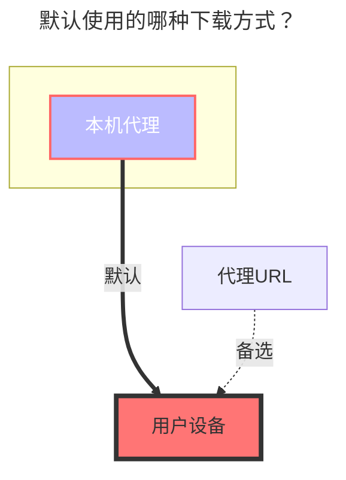

# Crypt（加密）

Crypt 驱动为您的文件和文件夹提供安全加密，相当于一个双重密码保护的保险库。只有拥有正确密码和盐值的用户才能访问加密内容。

**主要特性：**

- 文件和文件夹加密，支持多种安全级别
- 基于密码和盐值的保护机制
- 与 rclone crypt 完全兼容
- 支持多种文件名和目录加密模式

::: warning 重要安全提醒

1. 使用 Crypt 驱动前请仔细阅读本指南
2. 在生产环境部署前请先在本地测试配置，否则数据丢失自行承担！
3. **存储加密数据后绝不能修改配置** - 这会100%导致现有数据丢失
4. 请妥善保管您的密码和盐值 - 丢失它们将无法访问您的数据

**再次提醒请仔细阅读文档使用，否则数据丢失自行承担！**
:::

## 设置说明

1. **创建存储位置**

   在现有已挂载的驱动中创建一个**空文件夹**，用于存储加密后的文件。

2. **配置远程路径**

   在 Crypt 驱动配置的`远程路径`字段中填入空文件夹的路径。

   **配置示例：**
   - 原驱动路径：`/123`
   - 新建空文件夹：`/123/encrypted_storage`
   - 远程路径设置：`/123/encrypted_storage`

3. **上传文件**

   将文件上传到新创建的 Crypt 驱动挂载点。只有通过 Crypt 驱动上传的文件才会被加密。

   **文件访问方式：**
   - **加密文件**：位于远程路径中，显示为加密状态，无法直接打开
   - **解密访问**：通过 Crypt 驱动挂载点正常查看和访问文件

### 基础配置示例

对于首次使用加密的新手用户，建议使用以下默认配置：

::: danger 请务必仔细阅读以下注意事项，确保理解！

**重要声明：**

- **请勿修改配置！请勿修改配置！请勿修改配置！** 配置一旦保存后，请不要再进行修改！！！重要的事情重复三遍！
- **密码** 和 **盐值** 必须牢记！点击保存后，它们将被加密，无法以明文显示（图中的明文是尚未保存前的状态）。

> [**密码配置说明**](#密码)
>
> [**盐值配置说明**](#盐值)

---

- **如果你还没有再 Crypt 驱动内上传文件**，可以修改密码和配置。**否则请勿修改！**
- 修改配置后，Crypt 会尽量过滤非法文件/目录，但非法数据不会被自动删除。
  - **非法文件/目录** 是指由不同配置生成的加密数据。

:::

::: warning
关于加密组合，共有5种方式可供选择（实际上是6种），但需要注意的是，如果只启用文件夹加密而不加密文件名的配置将不会生效（例如下面举例的第1种情况）。

| 文件名加密          | 目录加密 | 状态    |
| ------------------- | -------- | ------- |
| `Off（关闭）`       | `启用`   | ❌ 无效 |
| `Off（关闭）`       | `禁用`   | ✅ 有效 |
| `Standard（标准）`  | `禁用`   | ✅ 有效 |
| `Standard（标准）`  | `启用`   | ✅ 有效 |
| `Obfuscate（混淆）` | `禁用`   | ✅ 有效 |
| `Obfuscate（混淆）` | `启用`   | ✅ 有效 |

:::

## 配置选项

### 文件名加密

**默认值：** `禁用`

**可用选项：**

| 模式                | 安全级别 | 说明                                               |
| ------------------- | -------- | -------------------------------------------------- |
| `Off（关闭）`       | 无       | 文件保持原名称并添加加密后缀（如：`file.txt.bin`） |
| `Standard（标准）`  | 高       | **推荐** - 强加密，具有良好的安全性                |
| `Obfuscate（混淆）` | 低       | 简单混淆，支持长文件名但可能产生特殊字符           |

---

下图中左侧开启了**文件名加密**和**文件夹名称加密**，右侧为解密后的Crypt驱动可以查看文件

- **未启用文件名加密**：原始名称 + 加密后缀，如左上角
- **启用文件名加密**：完全加密的文件名，无法识别内容，如左下角

### 文件夹名称加密

**默认值：** `禁用`

目录加密需要先启用文件名加密。激活后，文件夹名称也会被加密以增强安全性。

**配置组合：**

| 文件名加密          | 目录加密 | 状态    |
| ------------------- | -------- | ------- |
| `Off（关闭）`       | `启用`   | ❌ 无效 |
| `Off（关闭）`       | `禁用`   | ✅ 有效 |
| `Standard（标准）`  | `禁用`   | ✅ 有效 |
| `Standard（标准）`  | `启用`   | ✅ 有效 |
| `Obfuscate（混淆）` | `禁用`   | ✅ 有效 |
| `Obfuscate（混淆）` | `启用`   | ✅ 有效 |

### 加密后文件存储路径

加密文件的存储位置。可以是 OpenList 支持的任何可挂载驱动。

### 安全参数

::: danger
保存配置后，密码和盐值都会被加密，无法以明文显示。请在其他地方安全存储这些值。
:::

#### 密码

::: warning
请注意，使用rclone config导出的配置中，密码是混淆后的，无法直接使用，请在密码的前缀中添加 `___Obfuscated___` 后再使用。 
例如导出的密码是 `abc123xyz`，则在 Crypt 驱动中应填写 `___Obfuscated___abc123xyz`。
:::

主要加密密钥。**必须牢记** - 丢失后无法恢复。

#### 盐值

::: warning
请注意，rclone config 导出的配置中，盐值(即password2)是混淆后的，无法直接使用，请在盐值的前缀中添加 `___Obfuscated___` 后再使用。 
例如导出的盐值是 `abc123xyz`，则在 Crypt 驱动中应填写 `___Obfuscated___abc123xyz`。
:::

辅助加密密钥，相当于第二层密码保护。**必须牢记** - 丢失后无法恢复。

如果您不知道什么是加盐，可以视为第二个密码。可选，推荐。

### 高级选项

#### 加密后缀

**默认值：** `.bin`

加密文件的自定义后缀（仅在文件名加密禁用时使用）。必须以点开头（例如：`.abc`、`.encrypted`）。

#### 文件名编码

**默认值：** `base64`

**警告：** 仅在了解其影响时才修改此设置。其他编码选项未经充分测试，可能导致兼容性问题。

为了与 rclone 兼容，请在高级选项中配置此设置。

## 高级用法

### Rclone 兼容性

Crypt 驱动与 [rclone crypt](https://rclone.org/crypt) 目前完全兼容。

**重要说明：**

- OpenList Crypt 默认使用 `filename_encoding = base64` 以更好地支持长文件名，与 rclone 一起使用时请在高级选项中配置此设置
- 大小写不敏感的文件系统（如 Windows 本地存储）可能会出现问题

## 故障排除

### 启动错误

如果 Crypt 在 OpenList 启动时显示错误，可能是因为 Crypt 在其目标路径可用之前就启动了。

**解决方案：** 为 Crypt 驱动设置更高的[序号](./common.md#序号)以延迟其初始化。

### 数据访问问题

如果无法访问之前加密的数据：

1. 验证密码和盐值是否正确
2. 确保配置未被修改
3. 检查远程路径是否可访问
4. 确认文件名编码设置与原始配置匹配

## 默认使用的下载方式

