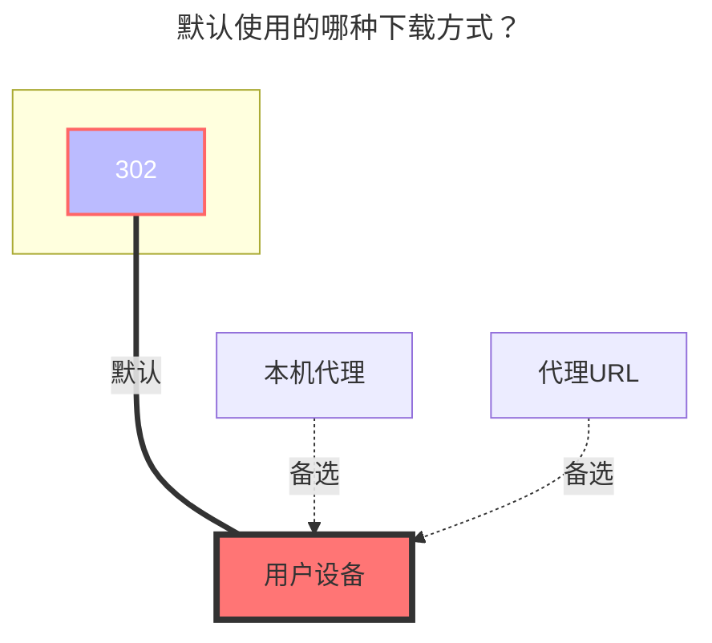

---
categories:
  - guide
  - drivers
top: 587
---

# Degoo

https://degoo.com/

**鉴权方式**：

1. 用户名 + 密码
2. 刷新令牌
3. 访问令牌

正常情况下，可以使用用户名 + 密码进行登录。如果您遇到了429错误，可以使用令牌登录。您可以从浏览器的请求内容或头部中获取访问令牌。

## 用户名

您的用户名。

## 密码

您用户的密码。

## 刷新令牌

用于自动更新令牌的刷新令牌，自动获取。

## 访问令牌

Degoo API 访问令牌，自动获取。

## 默认使用的下载方式

