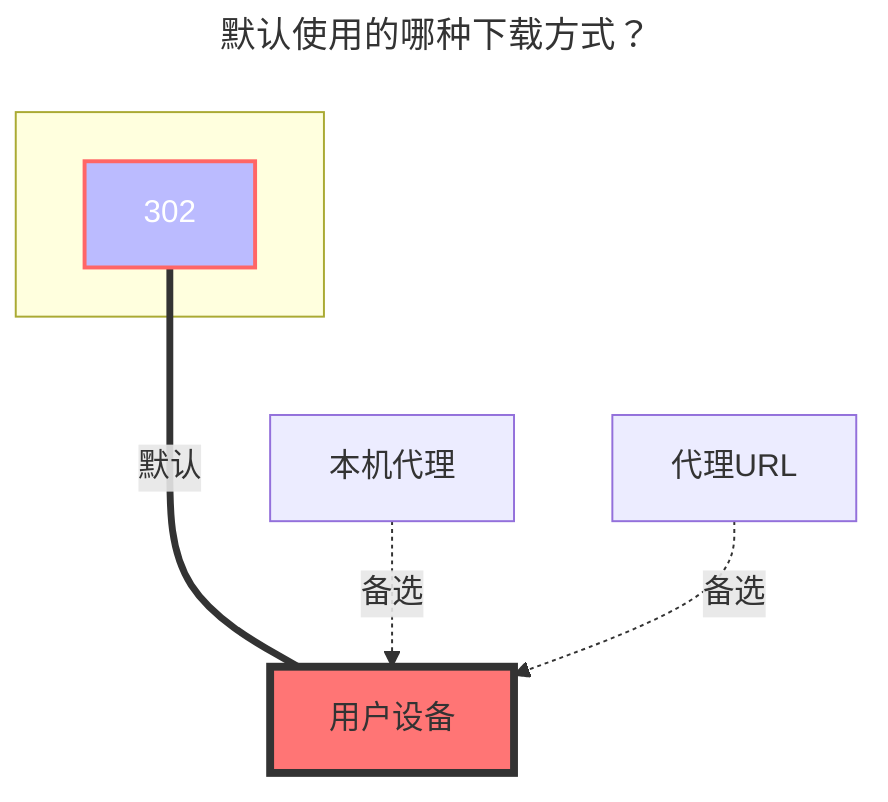

# Dropbox

Dropbox官网：https://www.dropbox.com/

## 获取刷新令牌

- **该驱动并不支持由 OpenList 提供的 online api 模式！**

- 以下教程适用于保持如框内所示的关闭状态

  

- 自建`客户端ID`和`秘钥`时，记得授权

获取方式如下：

1. 访问：<https://www.dropbox.com/developers/apps?_tk=pilot_lp&_ad=topbar4&_camp=myapps>，进入Dropbox的应用管理界面，点击创建应用

   

2. 进入应用后按下图配置应用类型

   

3. 在红框里可以获得id和secret，上面是id，下面是secret。

   

4. 配置回调地址，如果你有权限洁癖，不想使用外部回调地址，可以在此处配置本地地址，或者按照红框外的来

   

5. 最后，进入权限配置界面，配置app的权限

   

6. 访问：<https://api.oplist.org/> 进入token获取工具，选择dropbox后填入自己的id和secret，完成授权后可以获得刷新令牌。

7. 在OpenList配置界面，填入刷新令牌、id和secret即可使用，注意刷新令牌的长度大致为40-50个字符。

   

如果你有强烈的隐私意识，dropbox支持本地回调，可以使用以下全程由GPT提供的脚本快速实现，只和dropbox的服务器进行通信。

::: warning
由于回调地址是本地，而你并没有建立真正的本地回调服务器，所以请自己从浏览器地址栏获取返回的权限码

**请自行解决py运行的环境问题，或者使用上面搭建好的回调服务器**
:::

```python
import requests
import webbrowser
# 请替换为你自己的 Dropbox App 信息
CLIENT_ID = 'your_app_key'
CLIENT_SECRET = 'your_app_secret'
REDIRECT_URI = 'http://localhost:114514'
# 第一步：获取授权码
auth_url = (
  f"https://www.dropbox.com/oauth2/authorize"
  f"?client_id={CLIENT_ID}"
  f"&redirect_uri={REDIRECT_URI}"
  f"&response_type=code"
  f"&token_access_type=offline"  # 必须：获取 refresh_token 的关键参数
)
print("👉 请访问以下链接进行授权：\n")
print(auth_url)
webbrowser.open(auth_url)
auth_code = input("\n✅ 授权完成后，将跳转链接中的 ?code= 后面的授权码粘贴到此处：\n> ").strip()
# 第二步：交换 access_token + refresh_token
token_url = "https://api.dropboxapi.com/oauth2/token"
data = {
  'code': auth_code,
  'grant_type': 'authorization_code',
  'client_id': CLIENT_ID,
  'client_secret': CLIENT_SECRET,
  'redirect_uri': REDIRECT_URI
}
response = requests.post(token_url, data=data)
response.raise_for_status()
tokens = response.json()
# ✅ 最终只输出刷新令牌
print("\n🎉 获取成功！你的 Dropbox refresh_token 是：\n")
print(tokens.get("refresh_token"))
```

## 根文件夹ID

空为根目录：挂载全部文件
单文件夹ID：进入你需要挂载的文件夹复制顶部链接将`/home`后面的填写进去即可


### 默认使用的下载方式


