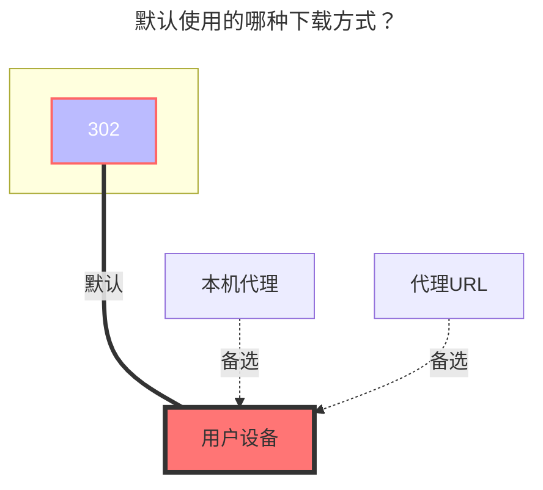

# FebBox

FebBox：https://www.febbox.com

- 需要代理，直连似乎无法访问？
- 目前上传功能不可用

## 根文件夹ID

根目录ID，默认为`0`。

其它目录 ID 查看进入文件夹后看顶部链接地址栏。

- **https://www.febbox.com/console#/files?parent_id=66889900**

  那这个目录 ID 就是 `66889900`

## 客户端 ID 和 秘钥

生成地址：**https://www.febbox.com/open/clients**

- 生成的客户端 ID 和秘钥和 OpenList 填写的顺序是相反的，注意别填错

  

## 用户 IP

**可选** ，用户下载时的 IP，引用官方说明

> IP 地址，可选参数。支持 IPv6 格式。填写后，将选择适合 IP 位置的最佳下载服务器。如果未填写，将使用请求的 IP。

## 默认使用的下载方式

