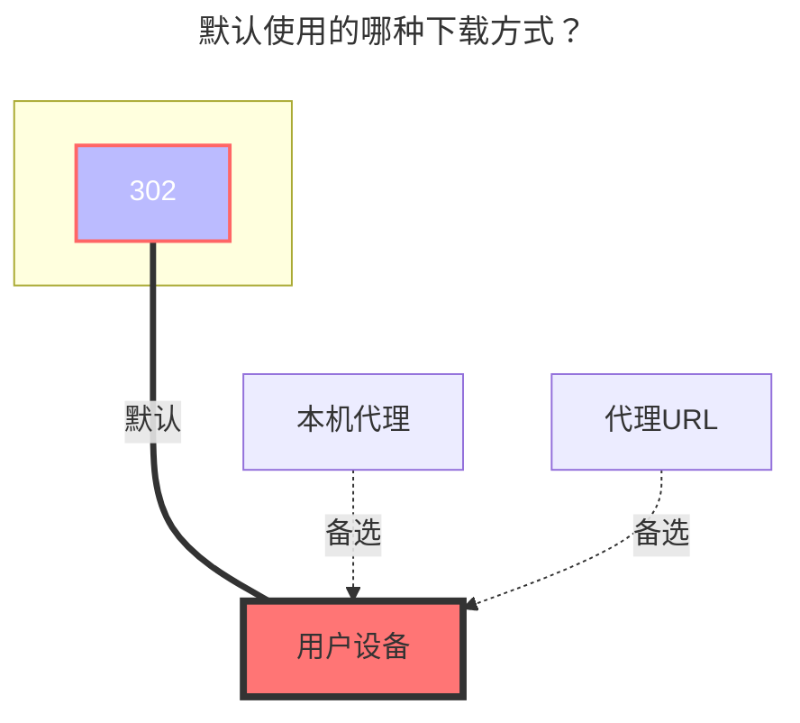

# 小飞机网盘

**https://feijipan.com/**

<!--@include: @/snippets/reverse-tip.md-->

::: danger
小飞机网盘对第三方平台有登录限制，尝试登录极易封号，请谨慎使用！
:::

## 根文件夹ID

根目录ID，默认为`0`，其它目录ID查看下图获取方式

## 账户、密码

填写自己的小飞机网盘帐号密码

## 已知问题

蓝奏云优享版返回的文件大小非 Bytes，而是 Kilo Bytes，因此无法使用文件大小准确判断一个文件是否被修改，需要注意同步软件的配置。

## 默认使用的下载方式

