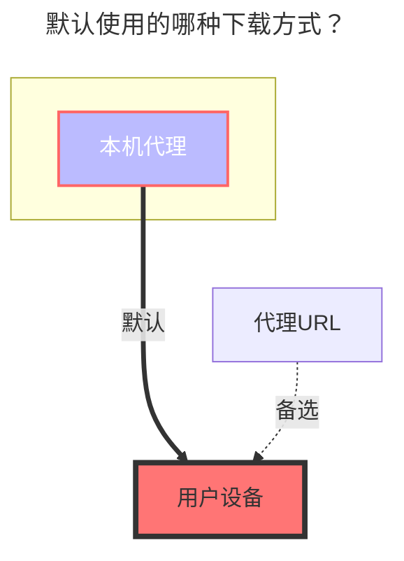

# FTP

## 地址

FTP 地址，需要包含端口。

## 用户名

FTP 用户名

## 密码

FTP 密码

## 根文件夹ID

根文件夹，默认 `/`，同本地存储。

## 列出前先进入目录

是否在列出文件前先进入目标目录。部分 FTP 服务器不支持直接带路径参数列出文件，开启此选项后会先 `cd` 进入目录再 `ls`，可以解决此类兼容性问题。默认: `false`。

### 默认使用的下载方式

