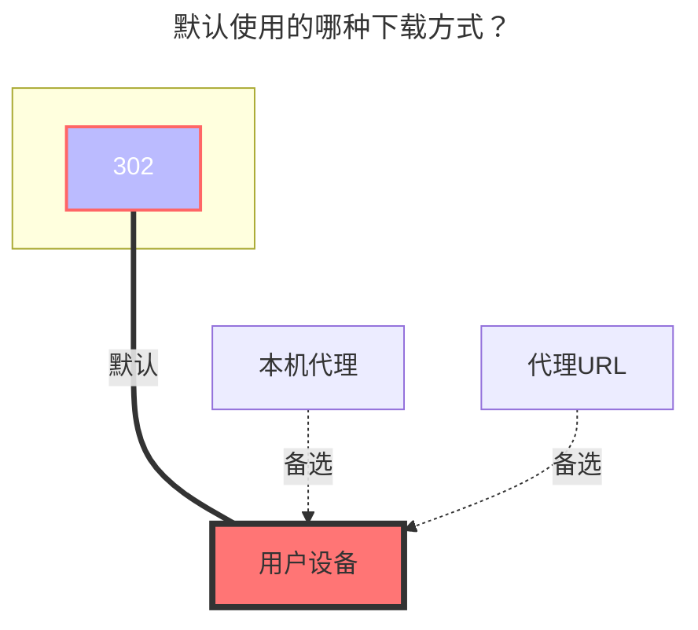

# GitHub 发行版

## 概述

GitHub Releases 驱动允许您将 GitHub 仓库的发布版本挂载为文件系统，通过熟悉的目录结构直接访问发布资源。

## API 速率限制

::: warning 速率限制

- **未认证请求**：每小时 60 次请求
- **已认证请求**（使用令牌）：每小时 5,000 次请求

建议使用个人访问令牌以避免触及速率限制。
:::

## 仓库配置

### 基本用法

**单个仓库挂载**

将单个仓库挂载到根目录：

```text
OpenListTeam/OpenList
```

等价于：

```text
/:OpenListTeam/OpenList
```

### 多个仓库

**挂载到子目录**

您可以将多个仓库挂载到不同的子目录：

```text
/openlist-gh:OpenListTeam/OpenList
/openlist-frontend-gh:OpenListTeam/OpenList-Frontend
```

前导的 `/` 可以省略：

```text
openlist-gh:OpenListTeam/OpenList
openlist-frontend-gh:OpenListTeam/OpenList-Frontend
```

## 配置选项

### 个人访问令牌

**使用场景：**

- 访问私有仓库时必需
- 建议使用以避免速率限制问题

**获取方法：**

1. 登录 GitHub
2. 访问：https://github.com/settings/tokens
3. 生成具有适当权限的新令牌

### 显示所有版本

**禁用（默认）：**

```
openlist/
├── openlist-linux-amd64.tar.gz
└── openlist-windows-amd64.zip
```

**启用：**

```
openlist/
├── v3.41.0/
│   ├── openlist-linux-amd64.tar.gz
│   └── openlist-windows-amd64.zip
├── v3.40.0/
│   ├── openlist-linux-amd64.tar.gz
│   └── openlist-windows-amd64.zip
└── v3.39.4/
    ├── openlist-linux-amd64.tar.gz
    └── openlist-windows-amd64.zip
```

启用后，所有可用的发布版本都会显示在单独的目录中。

### 分页控制（显示所有版本）

当启用"显示所有版本"时，您可以通过分页控制获取的发布数量：

- **`per_page`**：每页 release 数量（默认：`30`，最大：`100`）
- **`max_page`**：最大请求页数（`0` 表示不限页数）

当仓库有大量发布版本时，这些设置可以帮助您避免触发 API 速率限制。

**配置示例：**

最多请求 2 页，每页 50 个 release（最多获取 100 个 release）：

```text
per_page = 50
max_page = 2
```

::: tip
单次未认证请求计为 1 次，占每小时 60 次限额。设 `per_page=100`、`max_page=1` 时，获取单个仓库的 release 仅消耗 1 次请求。
:::

### 显示 README 文件

**禁用（默认）：**

```
openlist/
├── openlist-linux-amd64.tar.gz
└── openlist-windows-amd64.zip
```

**启用：**

```
openlist/
├── v3.41.0/
│   ├── openlist-linux-amd64.tar.gz
│   └── openlist-windows-amd64.zip
├── v3.40.0/
│   ├── openlist-linux-amd64.tar.gz
│   └── openlist-windows-amd64.zip
├── LICENSE
├── README.md
└── README_cn.md
```

::: tip
启用后，仓库的 README 和 LICENSE 文件会与发布版本一起显示。但是，不会显示文件夹大小和修改时间信息。
:::

## GitHub 代理设置

使用 GitHub 代理服务来加速在 GitHub 访问受限地区的下载。

**配置方法：**
将 GitHub 域名替换为代理服务 URL：

```text
https://gh-proxy.com/https://github.com
```

**可用代理服务：**

| 服务        | URL                                       |
| ----------- | ----------------------------------------- |
| GH-Proxy    | `https://gh-proxy.com/https://github.com` |
| GHProxy.net | `https://ghproxy.net/https://github.com`  |
| GHFast      | `https://ghfast.top/https://github.com`   |

示例：

```
转换前：https://github.com/owner/repo/releases/download/v1.0/file.zip
转换后：https://ghproxy.net/https://github.com/owner/repo/releases/download/v1.0/file.zip
```

::: warning
代理服务为第三方提供，可用性和性能可能存在差异。
:::

## 默认使用的下载方式


