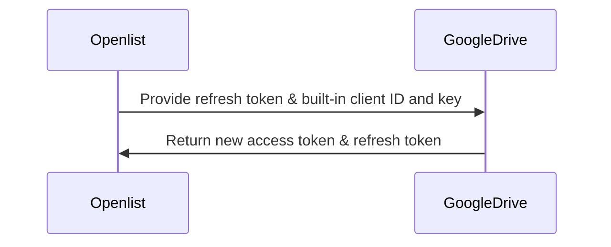
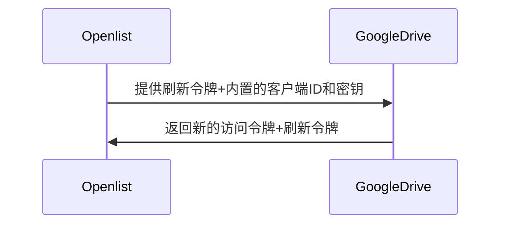
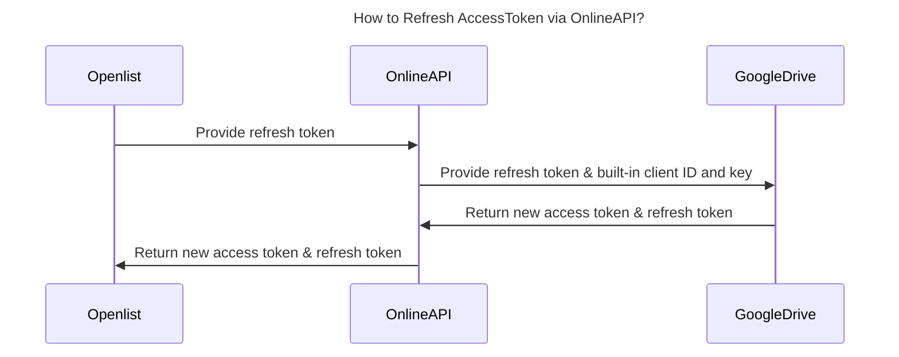
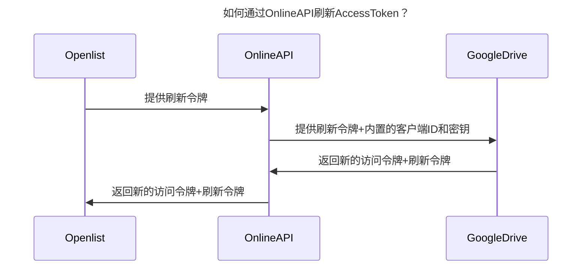
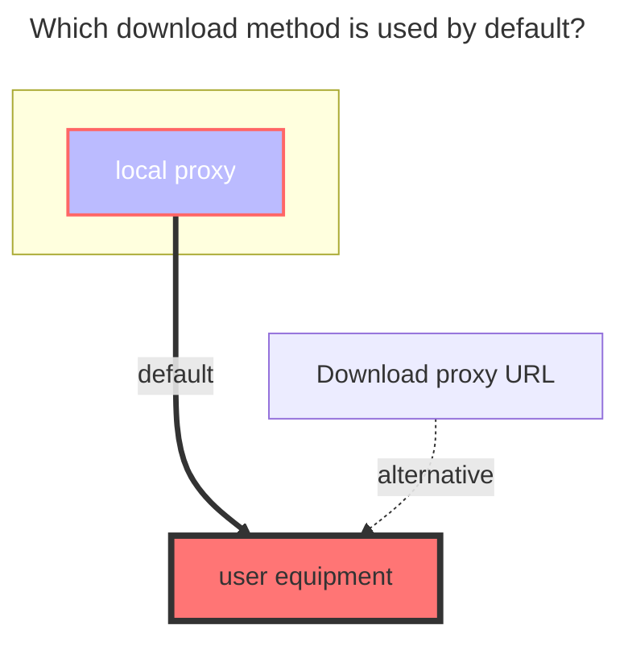
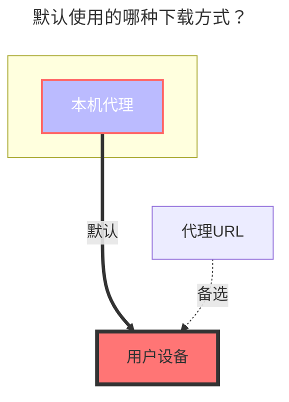

::: en
Supports team drives (fill in the directory ID of the team drive for the root directory ID)  
:::
::: zh-CN
支持团队盘（根目录ID填写团队盘的目录ID）
:::

## 1. Necessary Conditions { lang="en" }

## 1.必要条件 { lang="zh-CN" }

::: en
::: warning Notes

1. The machine where the OpenList service is deployed must first be able to connect to Google Drive.
2. The Google Drive API service must be activated. For the activation method, see [Enabling the Google Drive API](#_2-1-enabling-the-google-drive-api).
   > Refer to [Google Workspace > Google Drive > Guide](https://developers.google.com/workspace/drive/api/quickstart/js): https://developers.google.com/workspace/drive/api/quickstart/js  
   > :::  
   > ::: zh-CN
   > ::: warning 注意事项
3. 搭建OpenList服务的机器首先要能连接到Google网盘才可以喔~
4. 必须启动谷歌云盘API服务，启用方式见[启用 Google Drive API 的 API](#_2-1-启用-google-drive-api-的-api)
   > 参考 [Google Workspace>Google Drive>指南](https://developers.google.com/workspace/drive/api/quickstart/js): https://developers.google.com/workspace/drive/api/quickstart/js
   > :::

## 2. Preparation for Integration { lang="en" }

## 2.准备接入 { lang="zh-CN" }

### 2.1. Enabling the Google Drive API { lang="en" }

### 2.1.启用 Google Drive API 的 API { lang="zh-CN" }

::: en

1. On the [guide page](https://developers.google.com/workspace/drive/api/quickstart/js), find the `Enable API` button, click to enter the quick activation interface, click Next and Confirm to complete the activation.  
   :::
   ::: zh-CN
1. 在[指南页面](https://developers.google.com/workspace/drive/api/quickstart/js)中找到`启用API`按钮，点击进入快捷开启界面，点击下一步以及确认后，即可完成开启。
   :::
   ::: en
1. You can also visit the [Google Drive API management interface](https://console.cloud.google.com/apis/library/drive.googleapis.com), find the `Enable` button at the top, click and wait for the activation to complete.  
   :::
   ::: zh-CN
1. 也可以访问[谷歌云盘API功能管理界面](https://console.cloud.google.com/apis/library/drive.googleapis.com)，在上方找到`启用`按钮，点击后等待启用完成。
   :::
   ::: en
1. `Quota and System Limit Management` (optional): Switch to the `Quota and System Limits` tab, and set appropriate quotas and limits according to your usage and needs.  
   :::
   ::: zh-CN
1. `配额和系统限制管理`（可选）:切换到`配额和系统限制`选项卡，根据你的使用情况和需求，设置合适的配额和限制。
   :::

### 2.2. Creating an OAuth Client (optional; no need to create if using OpenList/Community server/self-hosted server) { lang="en" }

### 2.2.创建 OAuth 客户端（可选，如果使用OpenList/公益服务器/自建服务器，则不用创建） { lang="zh-CN" }

::: en

1. In the [Credentials interface](https://console.cloud.google.com/apis/credentials?hl=zh-cn), click the `Create Credentials` drop-down menu, and select and click `OAuth Client ID`.  
     
   :::
   ::: zh-CN
1. 在[凭据界面](https://console.cloud.google.com/apis/credentials?hl=zh-cn)中，点击`创建凭据`下拉菜单，选择和点击`OAuth 客户端 ID`
   
   :::
   ::: en
1. In the pop-up window, select `Web Application` and fill in the application name.  
   :::
   ::: zh-CN
1. 在弹出的窗口中，选择`Web 应用`，填写应用名称
   :::
   ::: en
1. In the `Authorized Redirect URIs`, enter `https://api.oplist.org/googleui/callback`. If using a self-hosted or Community server, enter the corresponding domain name, such as `https://your-domain.com/googleui/callback`.  
   :::
   ::: zh-CN
1. 在`授权的重定向 URI`中，填写 `https://api.oplist.org/googleui/callback`，如果是自建或者公益服务，请填写对应的域名，如 `https://your-domain.com/googleui/callback`。
   :::
   ::: en
1. Click the `Create` button to complete the creation of the OAuth client. Note: Please copy and save the `Client ID` and `Client Secret` for subsequent use.  
     
   :::
   ::: zh-CN
1. 点击`创建`按钮，完成 OAuth 客户端的创建。注：请复制和保存`客户端 ID`和`客户端密钥`，后续需要使用。
   
   :::
   ::: en
1. Add yourself as a test user. Find the `Target` menu on the left, click to enter, find the `+ Add User` button under `Test Users`, click and enter your Google account email address, then click Add.  
     
   :::
   ::: zh-CN
1. 将自己添加到测试用户中，在左侧找到`目标对象`菜单，点击进入后，找到`测试用户`下方的`+ Add User`按钮，点击后输入你的 Google 账号邮箱地址，点击添加即可。
   
   :::
   ::: en
1. After testing, you can publish the application. Find the `Target` menu on the left, click to enter, find the `Publish App` button under `Publishing Status`, click and confirm to complete the app publishing.  
     
   :::
   ::: zh-CN
1. 测试完毕后可以发布应用，在左侧找到`目标对象`菜单，点击进入后，找到`发布状态`下方的`发布应用`按钮，点击后确认发布即可完成应用发布。
   
   :::

### 2.3. Obtaining `Access Token` and `Refresh Token` { lang="en" }

### 2.3.获取`访问密钥`和`刷新密钥` { lang="zh-CN" }

::: en

1. Open the [OpenList Google Authorization Page](https://api.oplist.org/) **⚠️ If using a Community server/self-hosted server, visit the Community server/self-hosted server**.  
   :::
   ::: zh-CN
1. 打开[OpenList Google 授权页面](https://api.oplist.org/) **⚠️如果使用公益服务器/自建服务器，请访问公益服务器/自建服务器**
   :::
   ::: en
1. In the drop-down box on the page, select `GoogleDrive Login`.  
   
     
   :::
   ::: zh-CN
1. 在页面中下拉框中选择`GoogleDrive Login`
   
     
   :::
   ::: en
1. If you created an OAuth client ID in the above steps, enter the created `Client ID` and `Client Secret` in the following input boxes.  
   
     
   Otherwise, check ☑️ to use the API provided by OpenList. **⚠️ If using a Community server/self-hosted server, the built-in client ID and application secret of the Community server/self-hosted server are used at this time**.  
   
     
   :::
   ::: zh-CN
1. 如果在上面的步骤中创建了 OAuth 客户端 ID，请在下方输入框中填写刚才创建的`客户端 ID`和`客户端密钥`
   
     
   否则勾选☑️使用 OpenList 提供的API。**⚠️如果使用的公益服务器/自建服务器，此时使用的是公益服务器/自建服务器内置的客户端ID和应用机密**
   
     
   :::
   ::: en
1. Click the `Get Authorization` button, the system will jump to the Google authorization page, log in to your Google account, and authorize OpenList to access your Google Drive.  
     
   :::
   ::: zh-CN
1. 点击`获取授权`按钮，系统会跳转到 Google 授权页面，登录你的 Google 账号，并授权 OpenList 访问你的 Google Drive。
   
   :::
   ::: en
1. If the prompt `This app isn't verified by Google` appears, click `Advanced`, then click `Go to oplist.org (unsafe)` to continue. (If it is a Community server/self-hosted server, the domain name here is based on the actual Community service domain name, please carefully identify).  
     
   :::
   ::: zh-CN
1. 如果出现`此应用未经 Google 验证`的提示，请点击`高级`，然后点击`转至oplist.org（不安全）`继续。（如果是公益服务器/自建服务器，则此处域名以实际公益服务的域名为准，请仔细甄别）。
   
   :::
   ::: en
1. Please pay attention to the permission information on the authorization page (in the red box below), ensure that it only accesses your **Google Drive files**. If you find that the permission in the Community service is not limited to accessing **Google Drive**, please raise an issue in [openlistteam/docs/issues](https://github.com/openlistteam/docs/issues).  
     
   :::
   ::: zh-CN
1. 请注意授权页面上（下图红色框内）的权限信息，确保**只是**访问你的 **谷歌云端硬盘文件**，如果在公益服务中发现该权限不仅仅是访问**谷歌云端硬盘**，请在[openlistteam/docs/issues](https://github.com/openlistteam/docs/issues)提起issues。
   
   :::
   ::: en
1. After successful authorization, the system will return a `Refresh Token` and `Access Token`. Please copy and save the token for use in subsequent configurations.  
   
   
   :::
   ::: zh-CN
1. 授权成功后，系统会返回一个`刷新密钥`和`访问密钥`，请复制并保存该令牌，后续的配置中会使用。
   
   
   :::

## 3. Adding Google Drive to Alist { lang="en" }

## 3.在alist中添加谷歌云盘 { lang="zh-CN" }

### 3.1. Configuration Instructions { lang="en" }

### 3.1.配置说明 { lang="zh-CN" }

#### 3.1.1.**根文件夹 ID** { lang="zh-CN" }

#### 3.1.1. **Root Folder ID** { lang="en" }

::: en
Similar to Alibaba Cloud Drive, it is the last string in the official website URL, such as:  

:::
::: zh-CN
与阿里云盘类似，官网 URL 的最后一个字符串，如：

:::

### 3.2. Starting to Add { lang="en" }

### 3.2.开始添加 { lang="zh-CN" }

::: en

1. Open the Alist management interface and click the `Storage` menu on the left.  
   :::
   ::: zh-CN
1. 打开 Alist 的管理界面，点击左侧菜单中的`存储`。
   :::
   ::: en
1. On the storage list page, click the `Add Storage` button in the upper right corner.  
   :::
   ::: zh-CN
1. 在存储列表页面，点击右上角的`添加存储`按钮。
   :::
   ::: en
1. Select the driver as `Google Drive`.  
   
   
   :::
   ::: zh-CN
1. 选择驱动为`谷歌云盘（Google Drive）`。
   
   
   :::
   ::: en
1. Enter the mount path, such as: `google-drive`.  
   :::
   ::: zh-CN
1. 输入挂载路径，如：`google-drive`。
   :::
   ::: en
1. Enter the root folder ID obtained above in the `Root Folder ID`. If using the root directory, enter `root`.  
   :::
   ::: zh-CN
1. 在`根文件夹 ID`中填写上面获取的根文件夹 ID，如果使用根目录，请填写`root`。
   :::
   ::: en
1. Enter the refresh token obtained above in the refresh token (if not obtained, please refer to [Preparation for Integration](#_2-preparation-for-integration) ).  
   :::
   ::: zh-CN
1. 刷新令牌中填写上面获取的刷新令牌（如未获取，请参考[准备接入](#_2-准备接入)）。
   :::
   ::: en
1. If you are using the OAuth client ID and secret provided by `OpenList (or Community server/self-hosted server)`, configure according to `7.1` and `7.2`:  
    7.1. Check `Use online api` to indicate using the online API provided by OpenList.  
    7.2. Fill in the Api url address as `https://api.oplist.org/googleui/renewapi`. If it is a `Community server/self-hosted server`, enter the corresponding server address.  
   
   
   :::
   ::: zh-CN
1. 如果你使用的是 `OpenList （或者公益服务器/自建服务器）`提供的 OAuth 客户端 ID 和密钥，请按照`7.1`和`7.2`进行配置
   7.1. 在`Use online api`中勾选，表示使用 OpenList 提供的在线 API。
   7.2. Api url address填写为 `https://api.oplist.org/googleui/renewapi`，如果是`公益服务器/自建服务器`，请填写对应的服务器地址。
   
   
   :::
   ::: en
1. If you are using your own created OAuth client ID and secret, configure according to `8.1` and `8.2`:  
    8.1. Do not check `Use online api` to indicate using your own built OAuth client ID and secret.  
    8.2. Enter your `Oauth Client ID` in `Client ID` and your `Oauth Client Secret` in `Client Secret`.  
   
   
   :::
   ::: zh-CN
1. 如果你使用的是自己创建的 OAuth 客户端 ID 和密钥，请按照`8.1`和`8.2`进行配置
   8.1. 在`Use online api`中不勾选，表示使用自建的 OAuth 客户端 ID 和密钥。
   8.2. 在`客户端ID`中填写你的`Oauth 客户端 ID`，在`客户端密钥`中填写你的`Oauth 客户端密钥`
   
   
   :::
   ::: en
1. Click the `Add` button to complete the addition of Google Drive.
   :::
   ::: zh-CN
1. 点击`添加`按钮，完成谷歌云盘的添加。
   :::

## 4. Instructions on the "Use online api" Option { lang="en" }

## 4.关于`Use online api`选项的说明 { lang="zh-CN" }

### 4.1. AccessToken Refresh Process When Having Your Own Key { lang="en" }

### 4.1.自身有密钥的情况下，AccessToken刷新的方式 { lang="zh-CN" }

::: en

:::
::: zh-CN

:::

### 4.2. AccessToken Refresh Process When Not Having Your Own Key { lang="en" }

### 4.2.自身没有密钥的情况下，AccessToken刷新的方式 { lang="zh-CN" }

::: en

:::
::: zh-CN

:::

## 5. Which Download Method Is Used by Default? { lang="en" }

## 5.默认使用的哪种下载方式？ { lang="zh-CN" }

::: en

:::
::: zh-CN

:::
