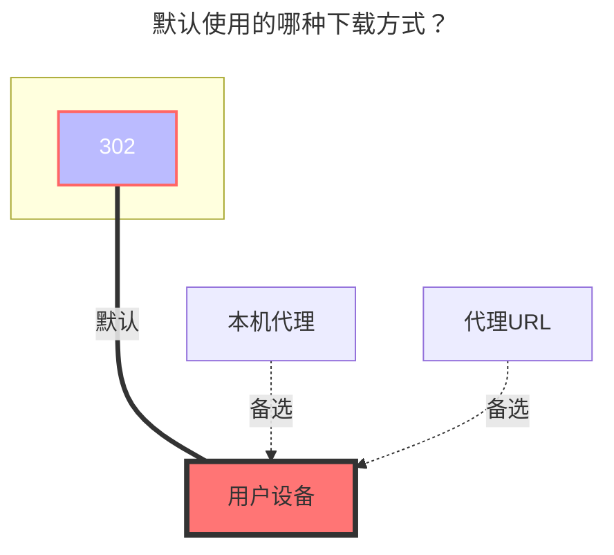

# 6盘

- `6盘（halalcloud）` 官方网站：[https://2dland.cn](https://2dland.cn/)
  - 网盘登录：https://drive.2dland.cn
- 官方公告、文档地址：https://2dland.yuque.com/r/organizations/homepage

## 根文件夹 ID

顶部地址栏路径，根文件夹是：`/`
子文件夹：`/A文件夹/C文件夹/C文件夹`

## 填写示例

在 `6盘官网`内点击`用户中心`，进入`授权管理`页面，输入 6 盘账户密码验证身份。

新建一个授权，名称可随意，点击确定后记录并保存`Client ID`和`Client Secret`。

在 OpenList 后台的存储页添加驱动，选择`HalalCloudOpen`，在下方填写`客户端 ID` 和`客户端密钥`，分别对应上方的值即可。

## 其它参数

- `Upload thread`：上传线程（默认为 3，范围 1-32）

- `主机`：（默认已给出，无需填写）

- `WebDav策略`：默认为`302重定向`，若有问题可以修改为`本地代理`

### 默认使用的下载方式

