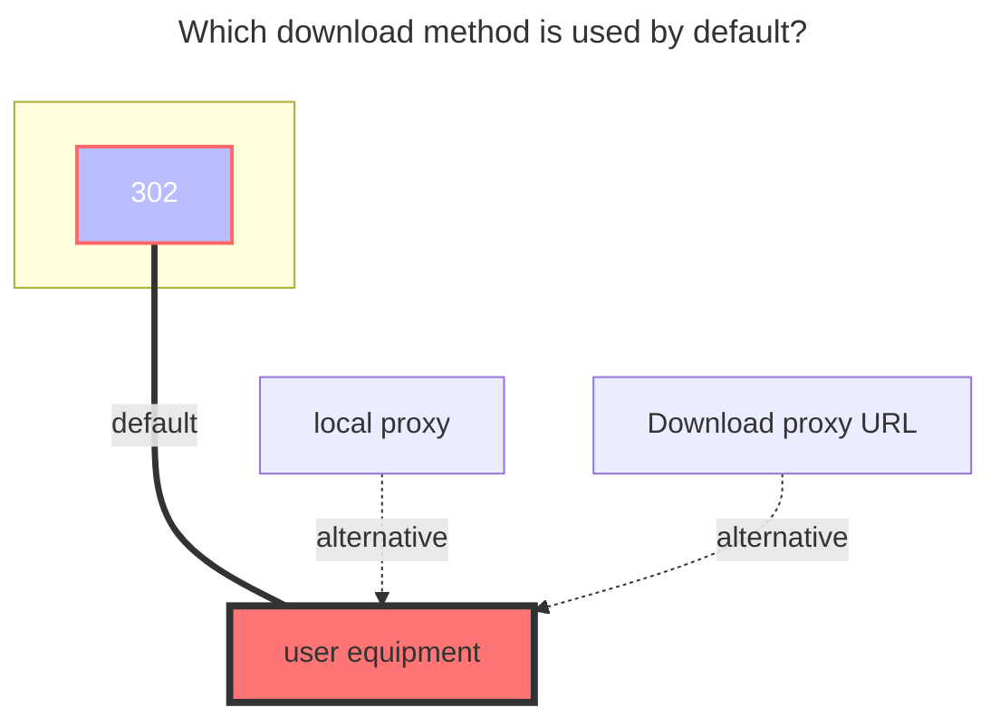
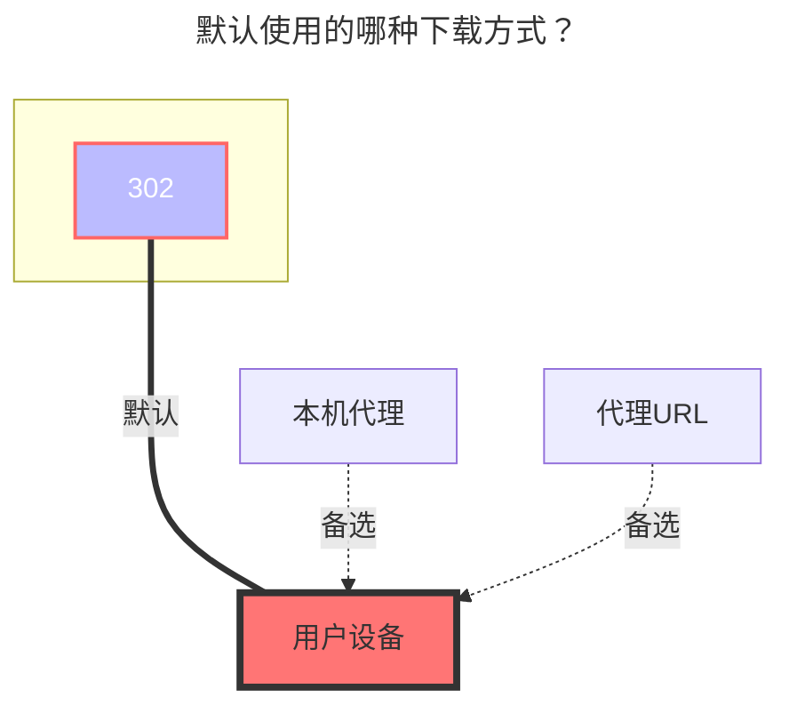

---
title:
  en: HuggingFace
  zh-CN: HuggingFace
icon: iconfont icon-state
top: 780
categories:
  - guide
  - drivers
---

::: en
Mount and manage repositories on [Hugging Face](https://huggingface.co/) (models, datasets and spaces).

Official website: <https://huggingface.co/>
:::
::: zh-CN
挂载并管理 [Hugging Face](https://huggingface.co/)（模型、数据集和 Space）上的仓库。

官方网站：<https://huggingface.co/>
:::

::: en
::: tip
- Files smaller than 5MB are committed directly to the repository.
- Files of 5MB or larger are uploaded through the Git LFS protocol.
- Download links point to `resolve` endpoints, so a HuggingFace proxy (`HF Proxy`) can be used to speed up downloads.
:::
::: zh-CN
::: tip
- 小于 5MB 的文件会直接提交到仓库。
- 大于等于 5MB 的文件会通过 Git LFS 协议上传。
- 下载链接指向 `resolve` 端点，可以使用 HuggingFace 代理（`HF Proxy`）加速下载。
:::

## Repo ID { lang="en" }

## 仓库 ID { lang="zh-CN" }

::: en
Required. The repository ID, in the format `username/repo_name`.
For example, for the repository `https://huggingface.co/gpt2`, fill in `gpt2`.
:::
::: zh-CN
必填。仓库 ID，格式为 `用户名/仓库名`。
例如仓库 `https://huggingface.co/gpt2`，这里填 `gpt2`。
:::

## API Token { lang="en" }

## API Token { lang="zh-CN" }

::: en
HuggingFace Access Token. Optional for reading public repositories, but required for uploading, deleting and writing operations.

You can create one at <https://huggingface.co/settings/tokens>.

We recommend selecting the `Read` permission to read public repositories, and selecting the `Write` permission when you need to upload or manage files.
:::
::: zh-CN
HuggingFace 访问令牌。读取公开仓库时可选，但上传、删除等写操作必须填写。

可在 <https://huggingface.co/settings/tokens> 创建。

读取公开仓库建议选择 `Read` 权限，需要上传、管理文件时请选择 `Write` 权限。
:::

## Ref { lang="en" }

## 引用 { lang="zh-CN" }

::: en
Branch, tag or commit SHA. Defaults to `main`.
Only branch names support write operations.
:::
::: zh-CN
分支名、标签或提交 SHA。默认为 `main`。
只有分支名支持写入操作。
:::

## Repo Type { lang="en" }

## 仓库类型 { lang="zh-CN" }

::: en
The type of the repository. One of:

- `model`: Model
- `dataset`: Dataset
- `space`: Space

Defaults to `model`.
:::
::: zh-CN
仓库类型，可选：

- `model`：模型
- `dataset`：数据集
- `space`：Space

默认为 `model`。
:::

## HF Proxy { lang="en" }

## HF Proxy { lang="zh-CN" }

::: en
Used to speed up downloads. Fill in a HuggingFace mirror proxy, for example `https://hf-mirror.com`.

It only affects the download links returned by this driver and does not affect API requests.
:::
::: zh-CN
用于加速下载。填写 HuggingFace 镜像代理，例如 `https://hf-mirror.com`。

仅影响本驱动返回的下载链接，不影响 API 请求。
:::

## Root Folder Path { lang="en" }

## 根目录路径 { lang="zh-CN" }

::: en
The root path of the mounted repository. Defaults to `/`.
:::
::: zh-CN
挂载仓库的根目录路径。默认为 `/`。
:::

## Upload Notes { lang="en" }

## 上传说明 { lang="zh-CN" }

::: en

- The API Token requires `Write` permission to upload files.
- Files smaller than 5MB are committed directly through the HuggingFace Commit API.
- Files of 5MB or larger are uploaded via the Git LFS batch API and stored on HuggingFace's backend storage (e.g. S3).
- Uploading to a repository also requires a working network connection to `huggingface.co`, and the configured OpenList proxy will be respected.

:::
::: zh-CN

- 上传文件需要 API Token 具备 `Write` 权限。
- 小于 5MB 的文件通过 HuggingFace Commit API 直接提交。
- 大于等于 5MB 的文件通过 Git LFS batch API 上传到 HuggingFace 后端存储（如 S3）。
- 上传仓库同样需要能够正常访问 `huggingface.co`，并会遵循 OpenList 中配置的代理。

:::

## The default download method used { lang="en" }

## 默认使用的下载方式 { lang="zh-CN" }

::: en

:::
::: zh-CN

:::
