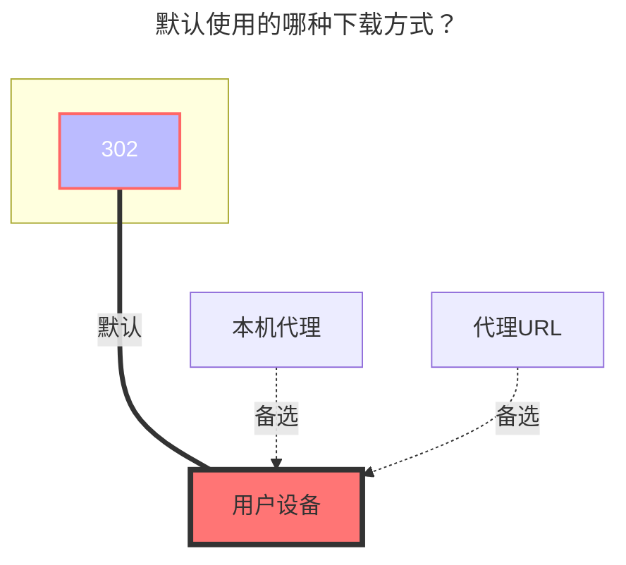

# 可道云

使用本驱动可以挂载 KodBox 的网盘空间到 OpenList。

## 根文件夹ID

假设你有一个网盘空间名为 `个人空间`，如果你只想挂载该网盘空间的内容，就要获取`个人空间`对应的 path；如果你只想展示该网盘空间内一个名为 `abc` 的目录，就要获取`个人空间/abc`对应的 path ，以此类推。

示例：如何获取 KodBox 网盘空间`个人空间`的path，得出path为`{source:5}`

在浏览器中打开 KodBox 网盘空间，在控制台模式下即可看到网盘空间对应的 path，不可留空不填。

## 地址

你的 KodBox 服务器地址，形如：

- `https://kodcloud.cc`
- `http://192.168.1.24:8000`

## 用户名

用于登录你的 KodBox 服务器的邮箱或用户名。

## 密码

邮箱或用户名对应的密码。

### 默认使用的下载方式

