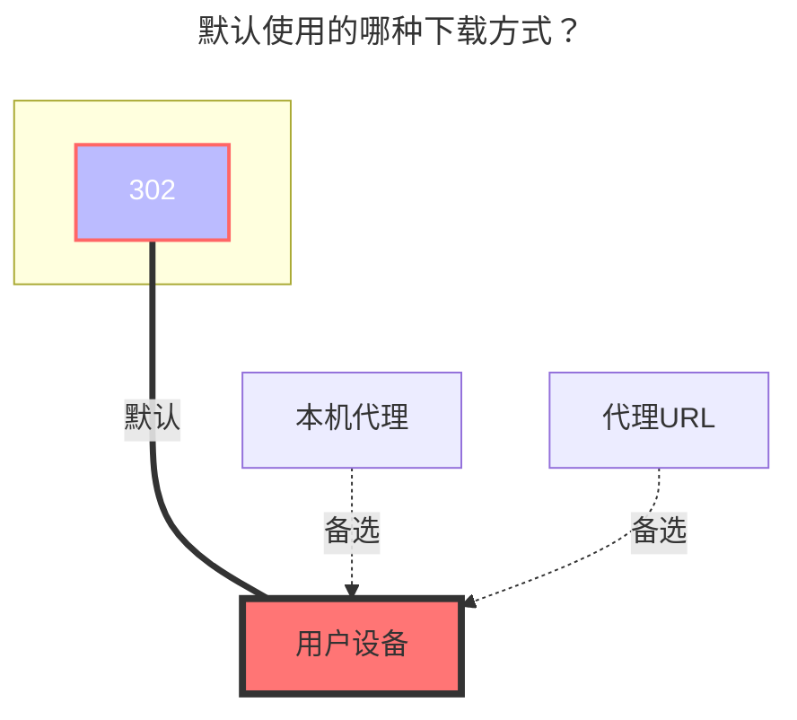

# 联想家庭储存链接分享

<!--@include: @/snippets/reverse-tip.md-->

需要购买联想设备 **https://pc.lenovo.com.cn**

## 根文件夹ID

根文件夹：留空

子文件夹：按图片所示获取

## 分享ID和分享密码

分享链接链接示例：https://siot-share.lenovo.com.cn/s/#/eb.3N93ZbJsaAjerjdm4N 提取码：`e5eu`

- **分享ID**：填写分享链接，自动提取分享链接中末尾的字符串 `eb.3N93ZbJsaAjerjdm4N`
- **分享密码**：提取码 `e5eu`

## 主机地址

默认使用公网的：**https://siot-share.lenovo.com.cn**

（不推荐）如果你使用局域网的可以改成联想设备内网地址：**http://192.168.XX.XX**

## 显示根文件夹

若取消勾选且 `分享ID` 为空，自动填入第一级文件夹的文件夹ID。
以上图为例，直接显示 `OpenList` 文件夹中的内容，不显示 `OpenList` 文件夹。

## 默认使用的下载方式

