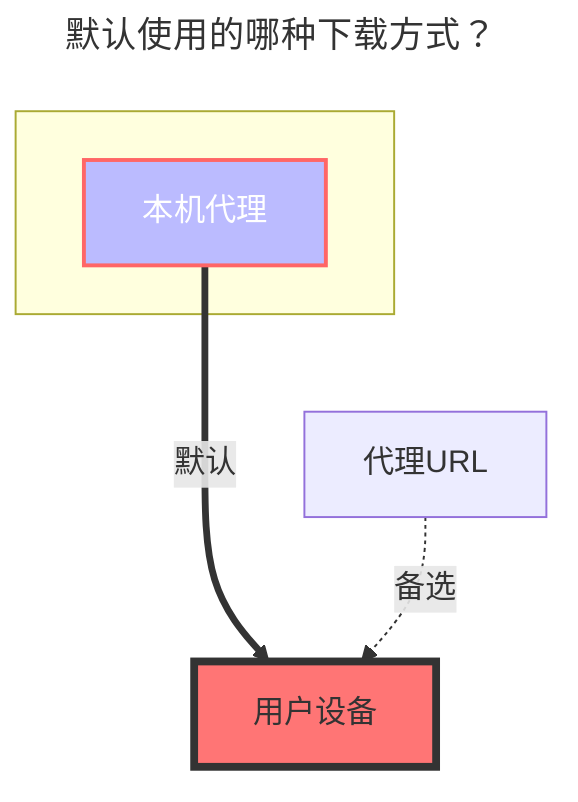

# 本机存储

支持挂载本机的目录。

## 根文件夹ID

您要挂载的文件夹的路径。 例如：

- Linux: `/root`
- Windows: `C:`

## 本地存储视频封面

需要使用 `ffmpeg` 工具来添加.

## macOS 本地存储 PDF 缩略图

在 macOS 上，本机存储驱动可以调用系统 Quick Look 工具，为 PDF 文件生成首页缩略图。

启用方法：

1. 开启 `缩略图（Thumbnail）`。
2. 开启 `PDF 缩略图（PDF thumbnail）`。
3. 建议配置 `缩略图缓存目录（Thumb cache folder）`，避免重复渲染同一 PDF 文件。

该功能默认关闭，并且仅在 OpenList 运行于 macOS 时可用。缓存未命中时会执行渲染，可能额外消耗 CPU 和内存。

## 回收站路径

回收站的路径，如果为空则永久删除或保持“永久删除”

如果填写此路径在删除本地存储文件时会将文件移动到此文件夹內，让你有一次后悔的机会。

填写方式参考上述挂载路径的方式不同系统填写方式不同。

如果不知道是否填写正确，可以先自己在测试环境进行测试一下再进行生产环境使用

- Linux: `/root`
- Windows: `C:`

## 默认使用的下载方式

