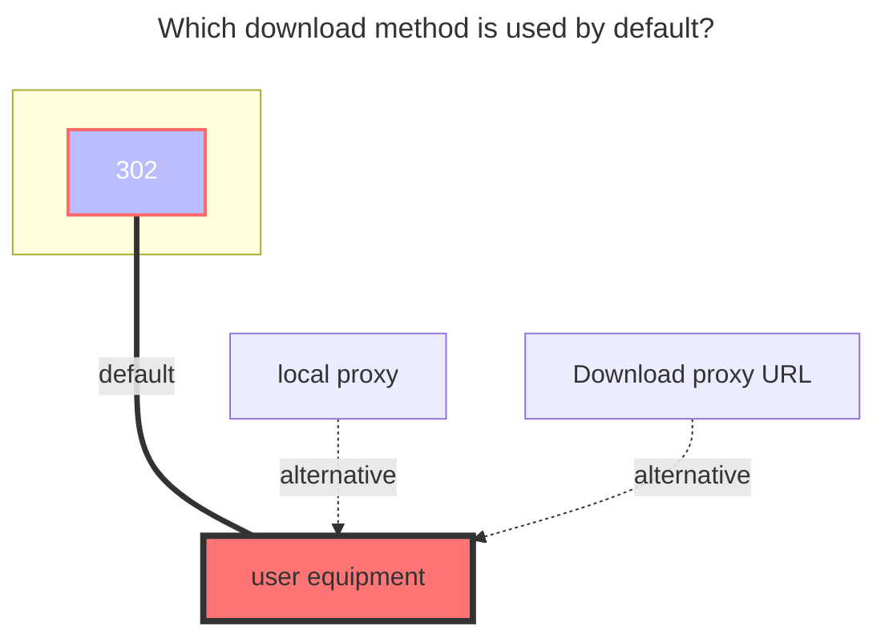
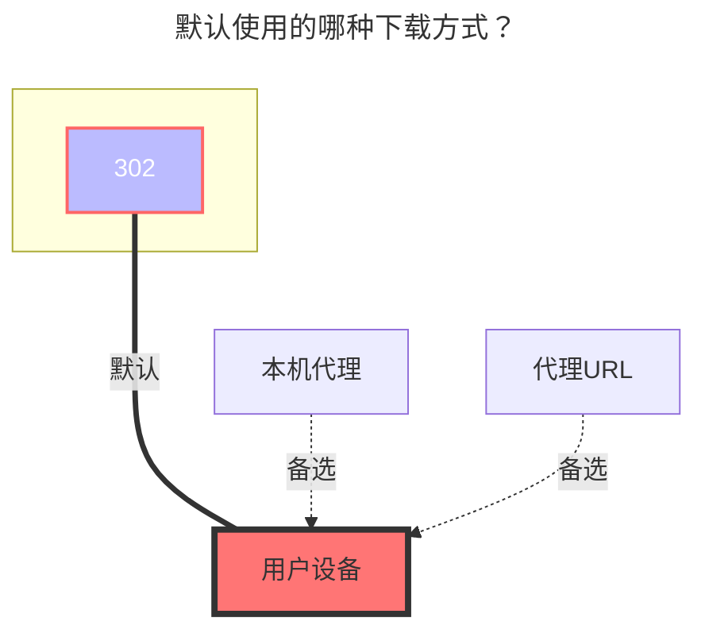

---
title:
  en: ModelScope
  zh-CN: ModelScope
icon: iconfont icon-state
# This control sidebar order
top: 680
categories:
  - guide
  - drivers
tag:
  - Storage
  - Guide
---

::: en
Mount a ModelScope model or dataset repository as an OpenList storage. OpenList uses the configured endpoint for the ModelScope API and file downloads.
:::
::: zh-CN
将 ModelScope 的模型或数据集仓库挂载为 OpenList 存储。OpenList 会使用配置的 Endpoint 访问 ModelScope API 并下载文件。
:::

::: en
::: warning
The ModelScope driver is available in OpenList versions that include the `modelscope` driver. If the driver is not shown in the storage list, update OpenList to a version containing this driver.
:::
::: zh-CN
::: warning
ModelScope 驱动需要使用包含 `modelscope` 驱动的 OpenList 版本。如果添加存储时找不到该驱动，请先更新 OpenList。
:::

## Add storage { lang="en" }

## 添加存储 { lang="zh-CN" }

::: en
Create a storage and select **ModelScope**, then fill in the following fields:
:::
::: zh-CN
添加存储并选择 **ModelScope**，填写以下参数：
:::

| Field              | English                                                    | 中文                                                    |
| ------------------ | ---------------------------------------------------------- | ------------------------------------------------------- |
| `Endpoint`         | ModelScope API endpoint. Default: `https://modelscope.cn`. | ModelScope API 地址，默认值为 `https://modelscope.cn`。 |
| `Token`            | ModelScope access token.                                   | ModelScope 访问令牌。                                   |
| `Repo ID`          | Repository ID, for example `owner/repository`.             | 仓库 ID，例如 `owner/repository`。                      |
| `Repo Type`        | `model` or `dataset`.                                      | `model` 或 `dataset`。                                  |
| `Revision`         | Branch, tag, or commit SHA. Default: `master`.             | 分支、标签或提交 SHA，默认值为 `master`。               |
| `Root Folder Path` | Optional subdirectory inside the repository.               | 可选，仓库内的子目录。                                  |
| `Commit Message`   | Commit message used when uploading.                        | 上传时使用的提交信息。                                  |

::: en
You can create an access token at [ModelScope Access Token](https://modelscope.cn/my/access/token). Keep the token private and use a token with only the permissions required by the repository.
:::
::: zh-CN
可以在 [ModelScope 访问令牌页面](https://modelscope.cn/my/access/token) 创建访问令牌。请妥善保管 Token，并尽量只授予仓库所需的权限。
:::

### The default download method used { lang="en" }

### 默认使用的下载方式 { lang="zh-CN" }

::: en

:::
::: zh-CN

:::

## Notes and troubleshooting { lang="en" }

## 注意事项与故障排查 { lang="zh-CN" }

::: en

- **401 or 403**: verify that the Token is valid and that the proxy forwards both `Authorization` and `Cookie` headers.
- **404**: check that the proxy preserves `/api/v1/` and that `/api/v1` was not added twice in the Endpoint.
- **Listing works but downloads fail**: make sure the proxy also forwards the `repo` download request and its `Revision` and `FilePath` query parameters. Disable response buffering for large files when necessary.
- **Uploads fail**: the proxy must support the driver's write methods and forward request bodies. Check upstream and proxy request-size limits.
- **Slow or interrupted downloads**: use HTTPS, disable proxy buffering where appropriate, and check timeout and maximum response-size settings on every proxy layer.
  :::
  ::: zh-CN
- **401 或 403**：检查 Token 是否有效，并确认代理同时转发了 `Authorization` 和 `Cookie` 请求头。
- **404**：检查代理是否保留了 `/api/v1/`，以及 Endpoint 中是否错误地重复添加了 `/api/v1`。
- **可以列目录但无法下载**：确认代理也转发了 `repo` 下载请求，以及 `Revision`、`FilePath` 查询参数。处理大文件时，必要时关闭响应缓冲。
- **上传失败**：代理必须支持驱动使用的写入方法，并转发请求体；同时检查上游和代理的请求体大小限制。
- **下载速度慢或中断**：使用 HTTPS，按需关闭代理缓冲，并检查各层代理的超时和响应大小配置。
  :::
