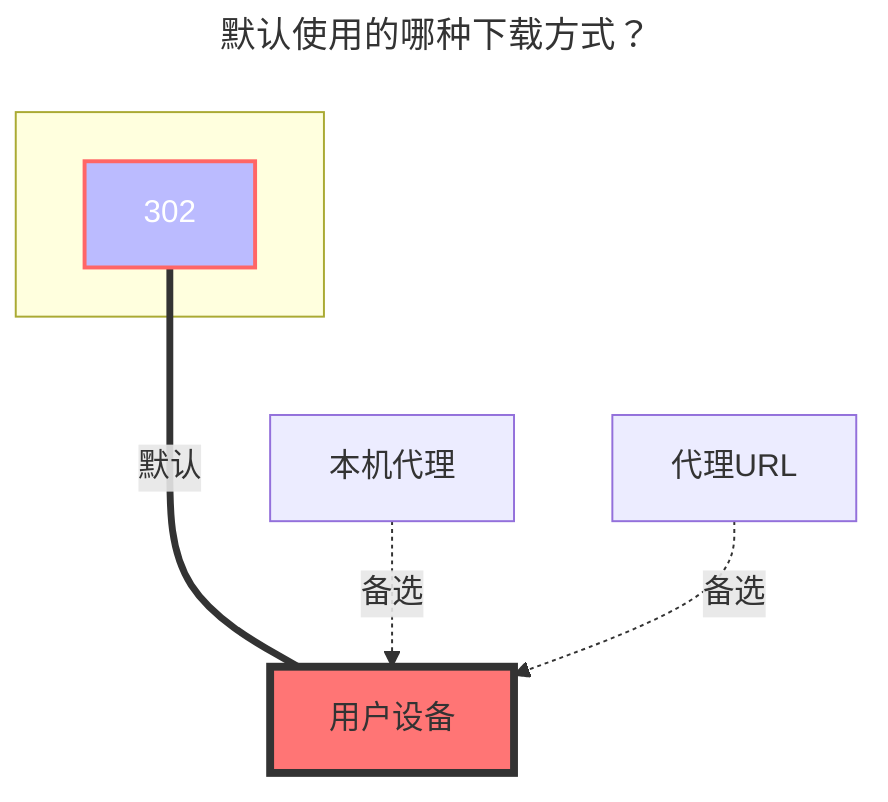

# 四川电信魔盘

<!--@include: @/snippets/reverse-tip.md-->

四川电信魔盘官网链接：**https://mopan.sc.189.cn/mopan/#/downloadPc**

- 没有网页端，只有`Android`,`IOS`,`PC-Win64位`,`iPad`,`TV`

## Sms code

第一次添加时先输入 手机号和密码的选项，然后在`Sms Code`输入 `send`，再点击保存会给你进行发短信，然后将验证码重新输入就可以添加

## 根文件夹ID

留空会自动填充为根目录

- 由于请求加密，暂时未想到合适的获取文件夹 ID 的方法

## 提示

1. `根文件夹ID`、`设备信息`不用填写,会自动帮你填充
2. 如果在[Sms Code](#sms-code)输入验证码后已经保存了，请进入编辑输入收到的验证码

### 默认使用的下载方式

