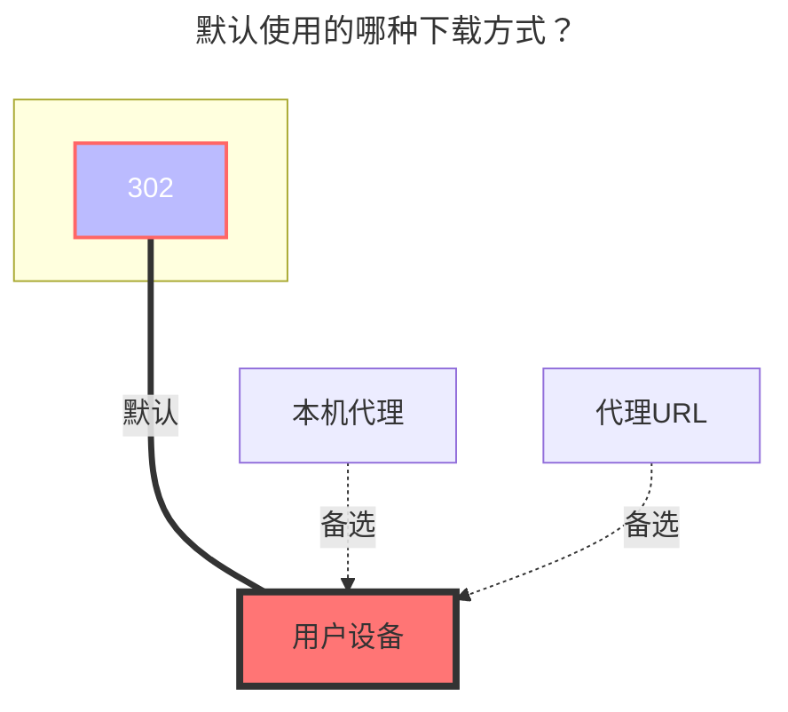
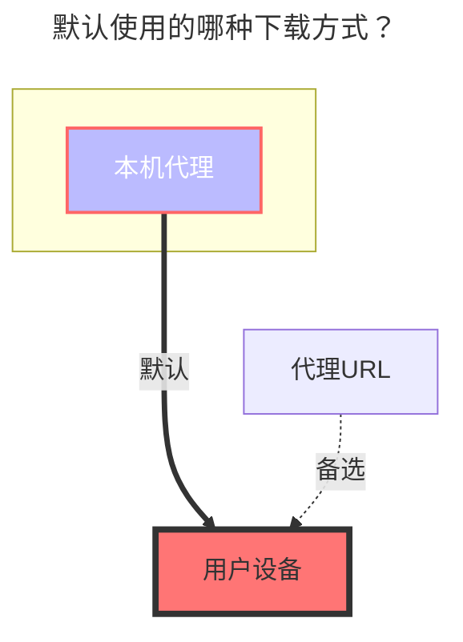

# OneDrive / 分享

:::tip

- 如果你拥有非家庭版的全局管理员权限，可使用 [OneDrive APP](onedrive_app.md) 驱动
- 如果你的账号不支持 API，（比如学校账号没有验证管理员，或者管理员禁用了 API），那么你也可以通过 WebDAV 挂载。有关详细信息，请参阅 [WebDAV 页面](webdav.md)

:::

## 1. 使用在线 API 的默认应用挂载

通过这种方式挂载，您无需自行创建应用。

1. 打开 <https://api.oplist.org>，根据自己的账户选择对应的 OneDrive 版本。

2. 勾选“使用 OpenList 提供的参数”，点击“获取Token”后登录需要挂载的 OneDrive账号，授权后返回页面即可获得刷新令牌。

   

3. 前往 OpenList 的存储管理界面选择 OneDrive 驱动，勾选“使用在线API”，填入刷新令牌后即可挂载

   

## 2. 手动创建应用挂载

OpenList 在线 API 提供的默认应用程序因为用户太多，可能存在请求速率限制等问题。此时您可以手动创建应用程序。

1. 根据您的账号类型，进入对应的管理页面
   - OneDrive 国际版：https://portal.azure.com/#blade/Microsoft_AAD_RegisteredApps/ApplicationsListBlade
   - OneDrive 世纪互联：https://portal.azure.cn/#blade/Microsoft_AAD_RegisteredApps/ApplicationsListBlade
   - OneDrive 德国版：https://portal.microsoftazure.de/#blade/Microsoft_AAD_RegisteredApps/ApplicationsListBlade
   - OneDrive 美国版：https://portal.azure.us/#blade/Microsoft_AAD_RegisteredApps/ApplicationsListBlade

2. 登陆后选择 `注册应用程序`，输入`名称`，选择`任何组织目录中的账户和个人`（注意这里不要看位置选择而是看文字，部分人可能是中间那个选项，不要选成单一租户或者其他选项，否则会导致登陆时出现问题），输入`重定向 URL`为 `https://api.oplist.org/onedrive/callback` ，点击注册即可，然后可以得到 `client_id`

   

3. 注册好应用程序之后，选择`证书和密码`，点击`新客户端密码`，输入一串密码，选择时间为最长的，点击`添加`

   （注：在添加之后输入的密码之后会消失，请记录下来 `client_secret` 的值）

   

4. 选择 `API 权限`，点击 `Microsoft Graph`，在`选择权限`中输入 `file`，勾选 `Files.read`（注：`Files.read` 是只读最小权限，图中权限较大，也同样可以），点击`确定`

   

5. 将上一步骤中获得的 `client_id` 和 `client_secret` 填入 <https://api.oplist.org> ，点击`获取Token`

6. 进入 OpenList 添加存储页面，取消勾选`使用在线API`，将获取到的 `client_id`、`client_secret`、`Callback URL`、`Refresh Token` 填入 OpenList 中

## 参数

### SharePoint 站点 ID

如果需要挂载 SharePoint，完成上面的步骤后，在显示刷新令牌的界面的下面有输入站点地址，输入站点地址后点击获取 `site_id`，然后将获取到的信息填入 OpenList 添加存储页面的 `站点ID` 中，确保已启用 `是否Sharepoint`。

### 根文件夹路径

默认为 `/`，如果需要自定义，就填路径就行，从根路径开始，和本地路径一样，比如 `/test`

### 分片大小

上传分片大小（MiB），默认值为 `5`，即 `5 * 1024 * 1024 = 5,242,880` 个字节，需要确保使用 320 KiB（`327,680` 个字节）倍数的字节大小。

### 自定义HOST

自定义加速下载链接。即反代你的 OneDrive 下载 API （如个人版：`my.microsoftpersonalcontent.com`）的域名。

::: warning

- 此处仅支持替换主机名，不支持路径。
- 请务必做好隔离，仅反向代理您自己的路径，否则会导致 Cloudflare 账号被封禁！

:::

## 默认使用的下载方式



## 3. OneDrive 分享

<!--@include: @/snippets/reverse-tip.md-->


### 链接

分享链接是这样的可以挂载，来自E3、E5、A1、A1P等

```html
https://connecthkuhk-my.sharepoint.com/:f:/g/personal/jhyang13_connect_hku_hk/EsEgHtGOWbJImxop6tF15FIBIH-ihrjuDclbrbmwWfY_RA?e=s6fitN
```

如果是OneDrive个人版的就不行，链接如下

```html
https://onedrive.live.com/?cid=64EA5FCC7735E8C6&id=64EA5FCC7735E8C6%2117289
```

### 密码

就是提取码，如果有就写，如果没有就不用写

### 默认使用的下载方式


