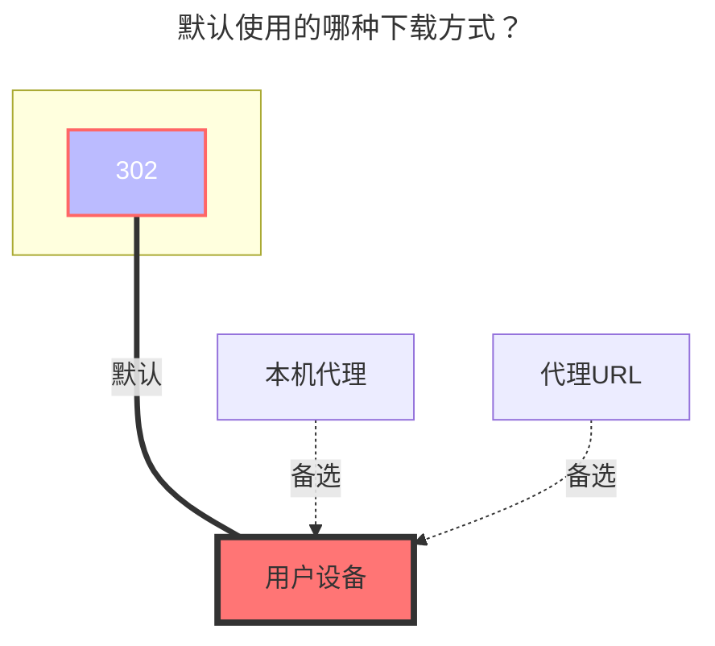

# PikPak / 分享

::: danger

1. `个人Pikpak`：谁发出请求谁能用
   - 例如你在 IP `1.1.1.1`服务器搭建的OpenList，但是你本人IP是`2.2.2.2`，无法播放下载
   - 或者开启代理中转策略

2. `分享Pikpak`：有大小限制，超出指定文件大小后只能播放40%~50%
   - 具体多大文件暂时未知具体数值

:::

## 1. PikPak挂载

### 用户名

邮件地址或者电话号码？

### 密码

密码

### 根文件夹ID

可以通过 https://mypikpak.com/ 获取，默认为 `root`。

### 平台

正常情况下不需要使用，遇到无法直接使用帐号密码登录的情况下可能需要使用

- 如果选择 `android`，则会模拟 安卓客户端 进行访问，如果想使用 `Refresh token` 进行登录，请对 `官方安卓端APP` 进行抓包

- 如果选择 `web`，则会模拟 官方网页端 进行访问，如果想使用 `Refresh token` 进行登录，请使用 `Web端` 获取的 `Refresh token`

### 刷新令牌

填写帐号和密码后，`刷新令牌方法`选择 `Oauth2` 然后保存就会自动填充刷新令牌、设备信息

#### Web端 Refresh Token 的获取

在官方网页登录后，打开F12控制台，进入下图中的页面（以 Chrome 为例）

找到以credentials开头的选项，选中后，观察下方的信息栏，从中可以获取到Refresh token，如下图所示

### 禁用媒体链接

OpenList 接口使用的是播放接口。当文件分辨率过高或文件过大时，Pikpak 会自动进行转码，这可能导致其他应用在同步时出现错误。启用此选项将不使用播放接口获取地址.

根据官方限制，当视频的码率超过 40 Mbps 或文件大于 50 GB 时，系统会自动触发转码。若视频已提供其他清晰度选项，则不会提供“原画”清晰度。

### 离线下载

支持在OpenList调用`Pikpak`离线下载功能

右下角选择离线下载选项选择`Pikpak`

- 支持：`magnet`、`http`、 `ed2k` 链接
- 也支持：X、TikTok、Facebook、TG的网址链接
- 仅支持使用Pikpak离线下载，非Pikpak会提示如下错误，**虽然添加离线下载提示成功但是在后台会提示错误**

  unsupported storage driver for offline download, only Pikpak is supported

  

## 2. PikPak分享挂载

::: warning
已知目前pikpak分享只能看40%-50%
:::

只需要填写 `用户名` ，`密码`，`分享ID` 三项即可 ，**根文件夹ID** 可写可不写，不写默认为root目录（根目录）

- 根文件夹ID：如果是多层目录，你想让哪个目录展示当根目录你就写哪个根目录.（参考下方获取根文件夹ID方法）
- 分享密码：分享的有密码就写，没有就不写

### 获取根文件夹ID

**当前pikpak分享的根目录ID已经无法在地址中获取，需要查看接口返回的数据**

- 打开F12控制台，进入网络（Network）选项卡
- 刷新页面，搜`detail`，找到最后一个`detail`请求
- 选择`detail`，在响应（Response）中找到`files`
- 找到对应的文件夹名称，查看其`id`字段内容即为根文件夹ID（可以通过`name`字段来确认对应的文件夹）

### 使用转码地址

默认不启用，打开后 下载地址将使用**转码后的地址**，可获取 **完整的转码后的文件**

- 打开 `使用转码地址` 选项后，无法使用 `OpenList` 网页版播放视频，但**可正常下载**或**使用第三方播放器**

### 批量添加PikPak分享挂载

使用的软件：**https://github.com/yzbtdiy/alist_batch**

<BiliBili bvid="BV1Ps4y1U7Zu" ratio="16:9" low-quality no-danmaku />

## 注意事项

**Q**：遇到验证码问题

**A**：

- 现在调整为使用 `oauth2` 方式来进行令牌的刷新
- 账号、密码 现在仅用于登录来获取 `Refresh token` 以及 `DeviceID` 的生成
- 遇到 `Your operation is too frequent, please try again later` 问题时，请尝试**在 `官方网页版` 或 `官方安卓端APP` 使用第三方授权**（例如：谷歌授权登录）进行登录，之后**获取 `Refresh token` 进行挂载**————注意 此时`Platform`的选用

---

**Q**：出现下图情况：`Failed load storage: failed init storage: Your operation is too frequent, please try again later`

**A**：说明访问过于频繁，该账号/IP将在一段时间内无法登录。注意：出现此情况后，**使用第三方授权可正常登录官方客户端**。同时，**使用该IP请求任何账号都有几率再次出现此问题**，可尝试使用`Refresh token`方式登录（不保证有效）

---

**Q**：出现 `Click Here` 提示

**A**：请点击进入，然后先打开F12或启动抓包软件，然后完成滑动验证码，如下图所示，获取`captcha_token`，填入驱动的`Captcha token`字段后，保存，此时驱动应该正常工作——**适用于使用账号密码登录的情况**

---

**Q**：出现下面的报错：`invalid refresh token for it may be has been refreshed by other process, more info redis: nil`

**A**：情况一： 则表明 `Refresh token` 无效，请重新获取；情况二：`Platform`：选择错误，请更换选项

---

**Q**：添加存储时提示：**Failed init storage: invalid_account_or_password** 怎么办，我输入的密码的对的

**A**：如果不是账号密码填错，可能是注册的时候使用了Google，FB等第三方快捷注册，虽然看起来账号是谷歌邮箱，但实际上是不能用邮箱登入，而必须使用第三方验证，**OpenList** 现在还不支持这种跳转到第三方的验证，**所以你要在账号设置里绑定一个邮箱同时设置一下登录密码**，或者重新注册一个新账号

---

**Q**：添加挂载时提示：**failed get objs: failed to list objs: Sorry, sharing is not available in the current region**

**A**：因为在国内PikPak是禁止访问的，给`OpenList`使用代理即可，如何让`OpenList`使用代理[**参考方案之一,此方法仅限于Windows搭建**](https://anwen-anyi.github.io/index/07-wenti.html#_41-alist%E5%A6%82%E4%BD%95-%E4%BD%BF%E7%94%A8-%E5%90%83%E5%88%B0-%E4%BB%A3%E7%90%86-proxy)

## 默认使用的下载方式

