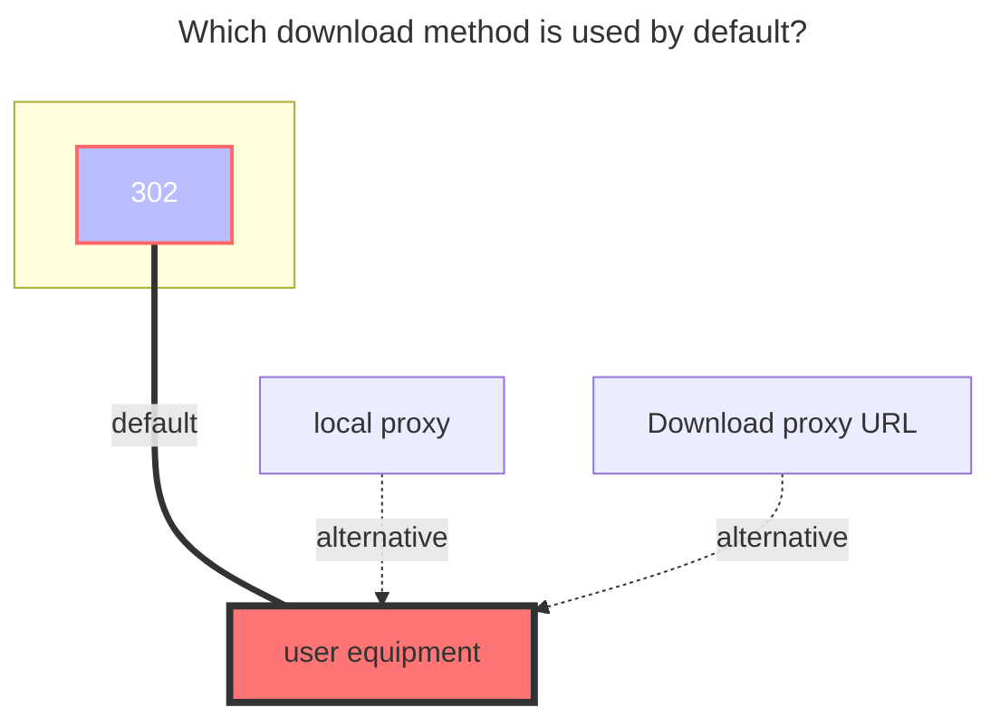
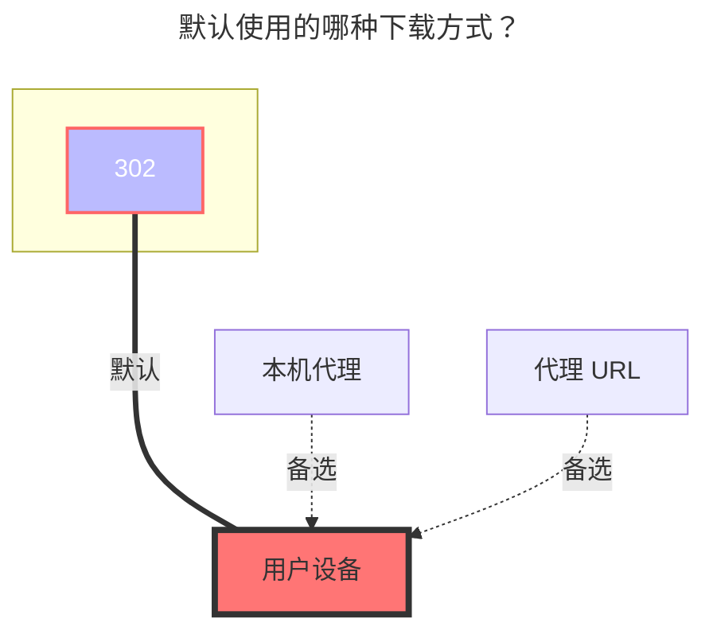

---
title:
  en: SJTU Netdisk
  zh-CN: 交大云盘
icon: iconfont icon-state
# This control sidebar order
top: 687
# A page can have multiple categories
categories:
  - guide
  - drivers
# A page can have multiple tags
tag:
  - Storage
  - Guide
  - '302'
# this page is sticky in article list
sticky: true
# this page will appear in starred articles
star: true
---

[https://pan.sjtu.edu.cn](https://pan.sjtu.edu.cn)

::: en
::: tip

- SJTU Netdisk uses `302` redirects for downloads by default.
- Login credentials may expire. Enable `Keep alive` to keep the session active.

:::

::: zh-CN
::: tip

- 交大云盘默认使用 `302` 重定向方式下载。
- 登录凭证可能会过期，建议开启 `Keep alive` 保持会话有效。

:::

## User Token { lang="en" }

## 用户令牌 { lang="zh-CN" }

::: en
Open your browser's developer tools (`F12`), select the **Network** tab, and enable **Disable cache**. After signing in to SJTU Netdisk, locate a request that contains authentication information. You can search for a `GET` request with a URL similar to:

```text
https://pan.sjtu.edu.cn/user/v1/user/1/<user_id>?user_token=<user_token>&with_belonging_teams...
```

The value of the `user_token` query parameter is the value to enter in this field.
:::
::: zh-CN
在浏览器中打开开发者工具（`F12`），切换到 **Network（网络）** 标签页并勾选 **Disable cache（禁用缓存）**。登录交大云盘后，找到携带认证信息的请求。可以搜索类似以下 URL 的 `GET` 请求：

```text
https://pan.sjtu.edu.cn/user/v1/user/1/<user_id>?user_token=<user_token>&with_belonging_teams...
```

其中 `user_token` 查询参数的值即为此字段需要填写的内容。
:::

## Keep alive { lang="en" }

## 保持活动状态 { lang="zh-CN" }

::: en
When enabled, OpenList keeps the `user_token` active. In the response headers of the request from the previous section, find `Set-Cookie`:

```text
keepalive='<keep_alive>; path=/; Httponly
```

Copy only the value represented by `<keep_alive>` and enter it in this field. Do not copy the entire cookie.
:::
::: zh-CN
开启后，OpenList 会保持 `user_token` 有效。在上一节请求的响应头中找到 `Set-Cookie`：

```text
keepalive='<keep_alive>; path=/; Httponly
```

只复制 `<keep_alive>` 所代表的值并填入此字段，不要复制整个 Cookie。
:::

## User ID { lang="en" }

## 用户 ID { lang="zh-CN" }

::: en
In the request URL from the [User Token](#user-token) section, use the value represented by `<user_id>`.
:::
::: zh-CN
在 [用户令牌](#用户令牌) 一节中的请求 URL 里，找到 `<user_id>` 所代表的部分并填入。
:::

## Order by { lang="en" }

## 排序依据 { lang="zh-CN" }

::: en
Choose the field used to sort files and folders:

- `Name`: Sort by file or folder name.
- `Modification time`: Sort by last modified time.
- `Size`: Sort by file size.
  :::
  ::: zh-CN
  选择文件和文件夹的排序依据：

- `名称`：按文件或文件夹名称排序。
- `修改时间`：按最后修改时间排序。
- `大小`：按文件大小排序。
  :::

## Order by type { lang="en" }

## 排序方向 { lang="zh-CN" }

::: en
Choose the sort direction:

- `Ascending`: Ascending order.
- `Descending`: Descending order.
  :::
  ::: zh-CN
  选择排序方向：

- `升序`：升序排列。
- `降序`：降序排列。
  :::

## The default download method used { lang="en" }

## 默认使用的下载方式 { lang="zh-CN" }

::: en



:::
::: zh-CN



:::
