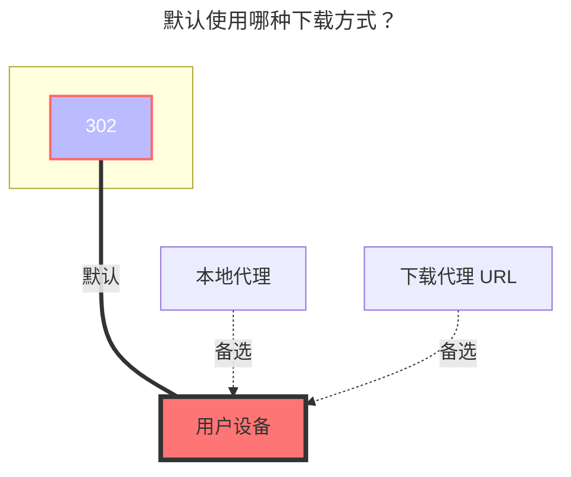

---
title:
  en: SJTU Netdisk
  zh-CN: 交大云盘
icon: iconfont icon-state
# This control sidebar order
top: 687
# A page can have multiple categories
categories:
  - guide
  - drivers
# A page can have multiple tags
tag:
  - Storage
  - Guide
  - '302'
# this page is sticky in article list
sticky: true
# this page will appear in starred articles
star: true
---

**https://pan.sjtu.edu.cn**

:::tip

- 交大云盘默认使用 `302` 重定向方式下载。
- 登录凭证可能会过期，建议开启 `Keep alive` 保持会话有效。

:::

<br/>

## **User token（用户令牌）**

在浏览器中打开开发者调试工具（F12），切换到 **Network（网络）** 标签页并勾选 **Disable cache（禁用缓存）**。登录交大云盘后，找到携带认证信息的请求。可以搜索以下get请求：
```
https://pan.sjtu.edu.cn/user/v1/user/1/<user_id>?user_token=<user_token>&with_belonging_teams...
```
其中 `user_token` 便为需要的user_token。


<br/>

## **Keep alive（保持活动状态）**

开启后，Openlist 会开启user_token保活。在上一节的请求中找到响应头 `Set-Cookie`

```
keepalive='<keep_alive>; path=/; Httponly
```

复制其中的 `keep_alive` 的值并填入。注意不要复制整个，只复制尖括号内值代表的内容


<br/>

## **User id（用户ID）**

在上方user token章节的请求中，找到get url中的`<user_id>`部分。

<br/>

## **Order by（排序）**

选择文件和文件夹的排序依据：

- `名称` &mdash; 按文件/文件夹名称排序
- `修改时间` &mdash; 按最后修改时间排序
- `大小` &mdash; 按文件大小排序

<br/>

## **Order by type（按类型排序）**

选择排序方向：

- `升序` &mdash; 升序
- `降序` &mdash; 降序

<br/>

### **默认使用的下载方式**

