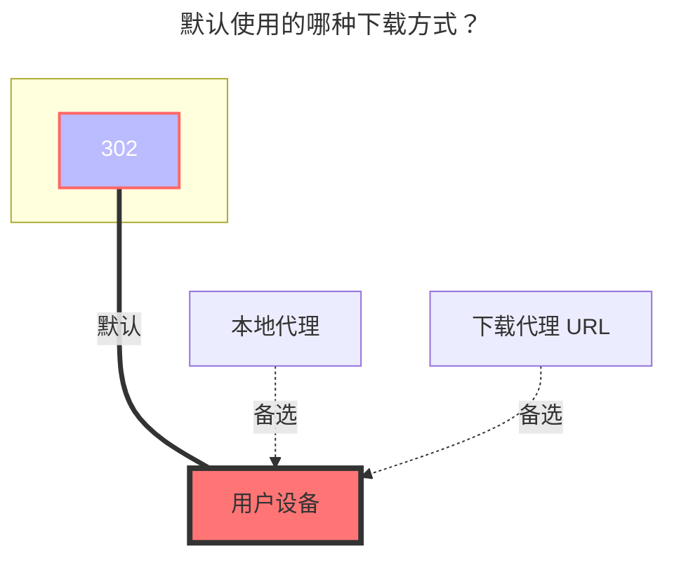

# Teldrive

<!--@include: @/snippets/tos-tip.md-->

Teldrive 是一个基于 Telegram 的云存储应用，由第三方开源仓库维护：[tgdrive/teldrive](https://github.com/tgdrive/teldrive)。

**功能特点**

- 无限存储空间
- 无文件大小限制
- 未订阅 Telegram Premium 时带宽会受限，速度取决于你的账户数据中心（DC1–DC5）与 Teldrive 服务之间的距离和带宽质量。

部署后端需要 **Telegram API（不是 Bot API）**。完整安装指南见：[Teldrive 安装教程](https://teldrive-docs.pages.dev/docs/getting-started/prerequisites)

## 地址

填写 Teldrive 后端的基础网址，**不要**包含末尾斜杠 `/`。

示例：`https://teldrive.example.com`

## 认证（Cookie）

仅支持 **Cookie** 方式认证。

登录 Teldrive 网页端后，从浏览器中获取 Cookie。

Cookie 应当以 `access_token=` 开头，这是一个 JWT。

::: tip
只需要**包含** `access_token=` 的那一串字符串。
:::

## 下载方式

**注意**：如果启用了 `使用分享链接` 选项，将会创建共享文件链接，下载链接有效期为 **1 小时**。

否则，您需要启用 OpenList 的 Web 代理。

## 分块大小

上传时的分块大小，单位 **MiB**。

默认值：`10`（10 MiB）。若大文件上传失败，可尝试调小。

当分块大小大于文件本身大小时，不会分块，文件将以单线程上传。

## 上传并发数量

上传并发线程数，默认：`4`。

请根据可用内存调整，粗略计算：  
`内存占用 ≈ 分块大小 × 并发数`

## 默认使用的下载方式

