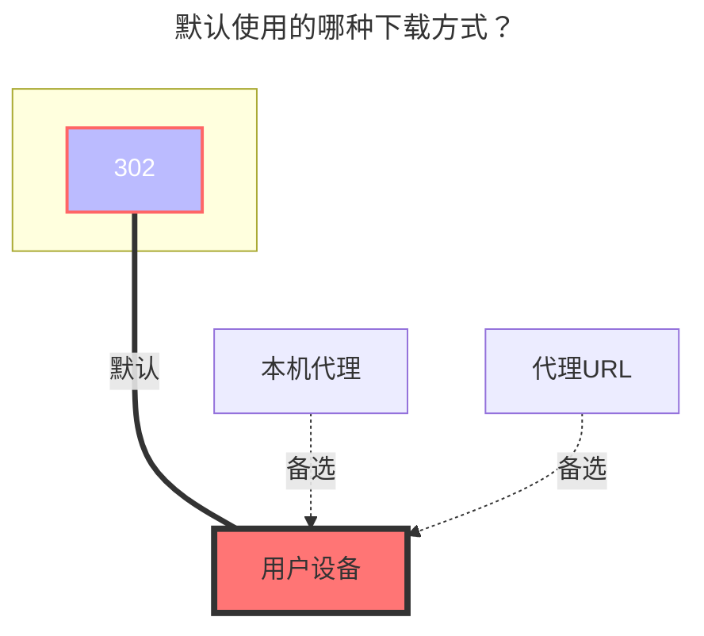

# 又拍云存储

::: tip
在使用 **302 重定向** 策略时，会自动在 URL 后拼接 `_upd` 与 `_upt` 参数，若又拍云控制台开启了 **“参数跟随”**，CDN 节点会将这些参数视为文件路径的一部分进行匹配，从而导致原本存在的文件返回 **404 Not Found**。

解决办法：

- 方法1：将又拍云控制台 **“缓存控制”** 中的 **“参数跟随”** 修改为 **“参数不跟随”**。

- 方法2：将 OpenList 的 WebDAV 策略设置为 **“本地代理”**，此模式下不会拼接干扰参数，但会消耗服务器流量。

:::

UPYUN 存储服务，简称 USS，[**又拍云USS官网**](https://console.upyun.com/services/file/)

## 存储桶

**UPYUN 存储桶服务名称**

## Endpoint

加速域名（默认的测试域名或已绑定域名，不是CNAME域名）
如果使用http协议，请自行添加`http://`协议头
又拍云提供的默认测试域名在部分网络环境下无法访问，且不支持https，建议使用自行绑定的域名

## 操作员名称

操作员名称

## 操作员密码

操作员密码

## 根文件夹 ID

根路径，不填则默认为根目录。

## 签名链接有效期

签名下载地址的有效期默认为 4 小时。

## 详情填写示意图

::: tip
如果你要用官方提供的的测试域名那必须要手动加http 例如： http://xxx.test.upcdn.net
如果想用HTTPS，当然也可以添加自己的域名就可以使用例如：https://you.xxx.com
操作员的权限自己需要哪个开启哪个，读取权限必须得开！
:::

### 默认使用的下载方式

