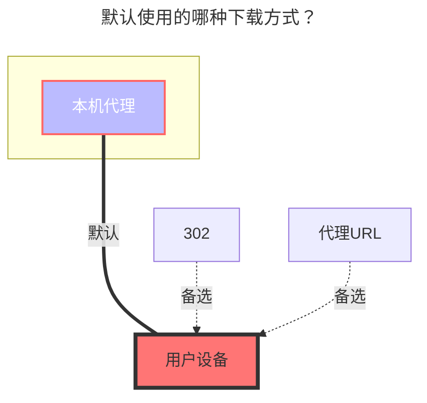

# WebDAV

## 地址

WebDAV 根地址

## 用户名

用户名

## 密码

密码

## 根文件夹ID

要挂载的文件夹路径，与加入地址相同

## 跳过 SSL 证书验证

是否跳过 SSL 证书验证。如果你的 WebDAV 服务器使用自签名证书，可能需要启用此选项。启用后会降低安全性，请谨慎使用。

## 支持 302 重定向

通常情况下，WebDAV 服务器会直接返回文件内容，由于需要授权，只能代理下载。但一些服务器会重定向到实际的文件地址，如 OpenList `WebDav 策略` 的 `302 重定向`。

WebDAV 存储设置的 `Web 代理` 选项默认为开启状态，如果关闭，OpenList 将会尝试获取重定向后的地址，然后将该地址返回给用户设备直接下载。

前提条件：

1. WebDAV 服务器必须支持返回 302，如果返回 200，则无法使用此功能，关闭 Web 代理将无法使用。
2. 返回的 302 地址必须是公开可访问的地址，不得需要授权信息，否则用户设备无法下载。
3. 在存储设置中关闭 `Web 代理` 选项。

## OneDrive/SharePoint

选择 vendor 为 sharepoint，支持国际版/世纪互联。

你可以通过[这个工具](https://alist.example.com/tool/onedrive/webdav.html)获取 WebDAV 根地址，如果要挂载指定的目录，在后面拼接即可。

用户名为 OneDrive 账号邮箱，密码即为 OneDrive 账号密码。

## 错误提示

- **failed get objs: failed to list objs: PROPFIND/根目录：403**

  需登陆 [Entra ID](https://entra.microsoft.com/#view/Microsoft_AAD_IAM/TenantOverview.ReactView?Microsoft_AAD_IAM_legacyAADRedirect=true)

  找到 `管理安全默认值` 点击并禁用（❗注：此项关闭后会关闭域的 Authenticator 验证）

  

  另外一种情况是对应的 OneDrive 账号太长时间没有操作也会提示这个问题，尝试从 OneDrive 网页端重新登录账号，系统会提示要求更改密码，更新密码后，使用更改后的密码再次尝试即可。

- **failed link: failed get link: redirect failed, status: 200**

  此错误表示 WebDAV 服务器不支持 302 重定向，需要在存储设置中启用 `Web 代理` 选项以使用代理下载。

## 默认使用的下载方式

