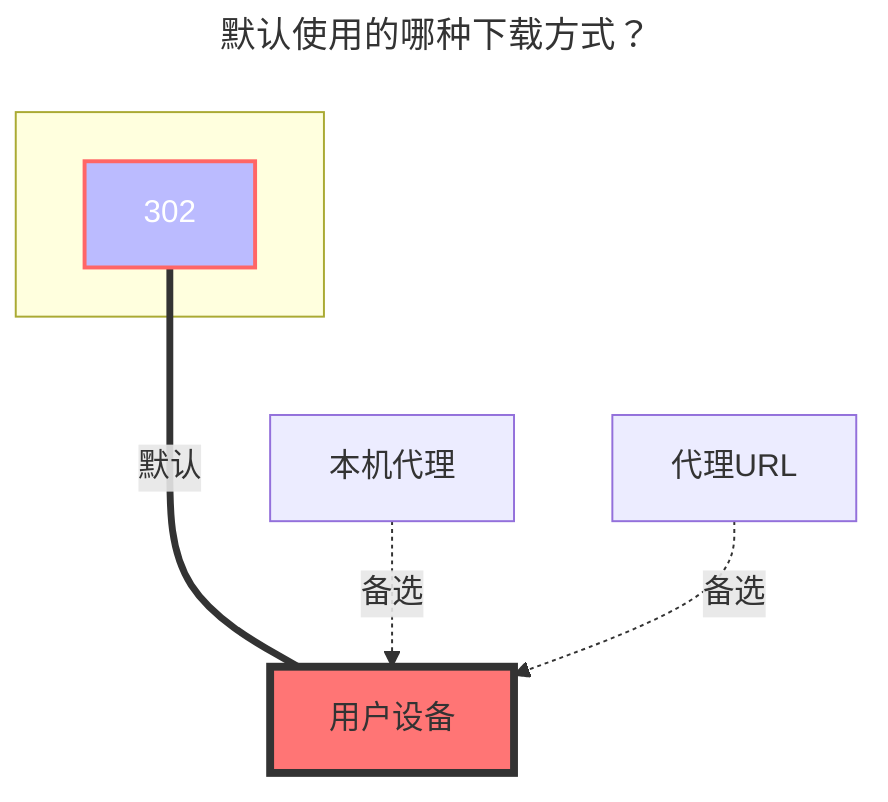

# 中国联通云盘

<!--@include: @/snippets/reverse-tip.md-->

[https://pan.wo.cn/](https://pan.wo.cn/)

## 获取令牌

::: tip
两个令牌获取方法的区别：

- 方法1：**令牌有效期为七天**，如果登录网页端的联通云盘会将OpenList挂载的踢下线导致失效，登录手机端没问题，不会被踢下线，可以同时并存。

- 方法2：**令牌有效期为两个月**，登录网页端的联通云盘没问题，如果登录手机端则会将OpenList挂载的踢下线导致失效。

:::

### 方法一

1. 打开开发者工具
2. 打开官网 <https://pan.wo.cn/> 登录
3. 找到请求内容为这个的请求：
   
4. 在响应中找到token：
   

### 方法二

1. 打开开发者工具
2. 打开官网 <https://panservice.mail.wo.cn/h5/wocloud_ai/login> 登录
3. 在开发者工具中找到应用选项卡，并选择会话存储空间：
   
4. 根据图中箭头指引找到`刷新令牌`和`访问令牌`

## 根文件夹ID

- 个人云：**0**
  - 单独文件夹ID：未知(后续补充)
- 家庭云：未知(后续补充)
  - 家庭云单独文件夹ID：未知(后续补充)

## 类型

个人云：将`Family ID`空着就是个人云
家庭云：填写`Family ID` 登录【联通智家APP】->【我的】->【您的家】，点击"+"【邀请家人】->【微信邀请】，将链接发送给自己，打开后复制“groupId=”后面的全部文本

## OpenList挂载填写示例：

将使用工具获取的 `refresh_token填入刷新令牌`，`access_token填入访问令牌`

## 默认使用的下载方式

