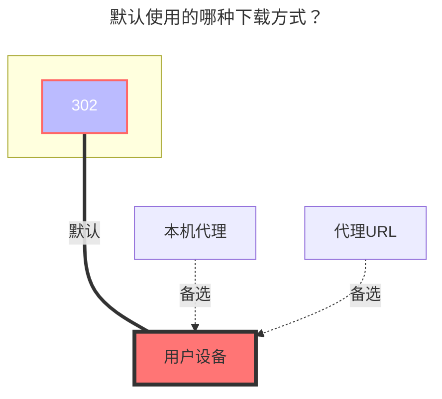

# Yandex云盘

## 刷新令牌

[点击这里](https://oauth.yandex.com/authorize?response_type=code&client_id=a78d5a69054042fa936f6c77f9a0ae8b) 来获取刷新令牌。

## 根文件夹ID

要挂载的根文件夹，默认为 `/`

## 默认使用的下载方式

```mermaid
---
title: 默认使用的哪种下载方式？
---
flowchart TB
    style a1 fill:#bbf,stroke:#f66,stroke-width:2px,color:#fff
    style a2 fill:#ff7575,stroke:#333,stroke-width:4px
    subgraph ide1 [ ]
    a1
    end
    a1[302]:::someclass====|默认|a2[用户设备]
    classDef someclass fill:#f96
    c1[本机代理]-.备选.->a2[用户设备]
    b1[代理URL]-.备选.->a2[用户设备]
    click a1 "../drivers/common.html#webdav-策略"
    click b1 "../drivers/common.html#webdav-策略"
    click c1 "../drivers/common.html#webdav-策略"
```
